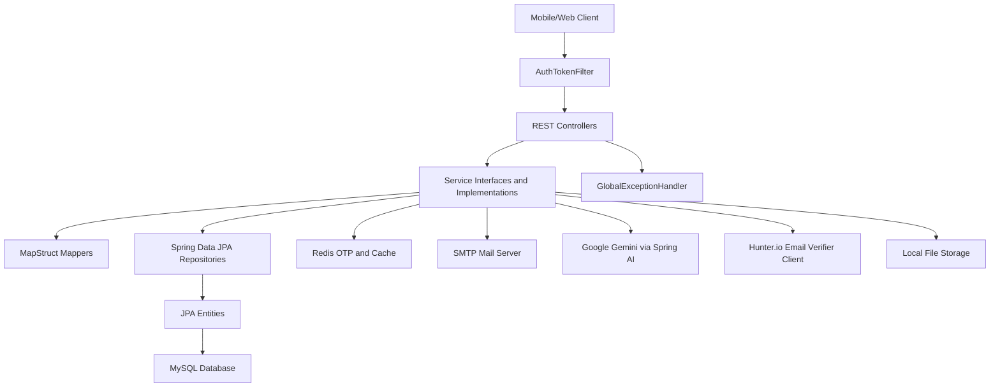
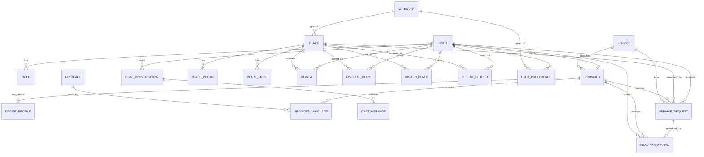
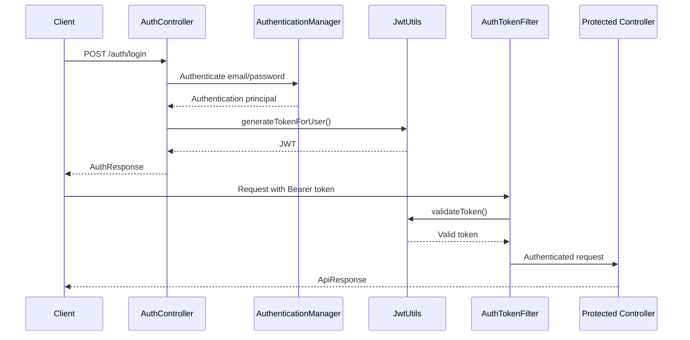

# Sawah Backend

Sawah Backend is a Spring Boot REST API for a tourism platform focused on helping tourists discover places, manage travel preferences, interact with local service providers, and use an AI travel assistant. The codebase is organized as a layered Java backend with JWT security, MySQL persistence, Redis-backed OTP storage, localized English/Arabic messages, and local filesystem image storage.

> This README is generated from the current codebase. Where a capability, deployment artifact, or operational detail cannot be proven from code, it is marked as: **Not identifiable from the codebase.**

## Table of Contents

- [Project Overview](#project-overview)
- [Features](#features)
- [Screenshots and Visual Assets](#screenshots-and-visual-assets)
- [Technology Stack](#technology-stack)
- [System Architecture](#system-architecture)
- [Project Structure](#project-structure)
- [Database Design](#database-design)
- [API Documentation](#api-documentation)
- [Authentication and Security](#authentication-and-security)
- [Configuration](#configuration)
- [Installation](#installation)
- [Docker](#docker)
- [Testing](#testing)
- [Logging and Monitoring](#logging-and-monitoring)
- [External Integrations](#external-integrations)
- [Design Patterns](#design-patterns)
- [Performance Considerations](#performance-considerations)
- [Deployment](#deployment)
- [Known Issues](#known-issues)
- [Future Improvements](#future-improvements)
- [Contributing](#contributing)
- [License](#license)

## Project Overview

| Item | Details |
| --- | --- |
| Project name | Sawah Backend |
| Maven artifact | `com.sawah:sawah-backend` |
| Application name | `Sawah Application` |
| Business problem solved | Provides backend services for a tourism application where tourists can discover places, save interests, manage favorites/visited places, review destinations, browse approved local providers, and use an AI-powered travel chat assistant. |
| High-level description | A monolithic Spring Boot API with controller, service, repository, entity, mapper, security, configuration, and exception layers. |
| Main objectives | Authenticate users, manage tourist and provider profiles, expose place discovery APIs, support category/language/service administration, persist chat history, generate AI chat responses, and localize API messages. |
| Target users | Tourists, service providers, administrators, backend engineers, API consumers, and technical reviewers. |

## Features

### Tourist Features

- Register and log in with JWT-based authentication.
- Complete and update tourist profile data with optional profile image upload.
- Change password and reset forgotten password through email OTP.
- Switch preferred language between `AR` and `EN`.
- Browse categories, services, languages, popular places, places by category, places by governorate, and place typeahead suggestions.
- View place details with photos, prices, review summary, favorite status, and visited status.
- Save and remove favorite places.
- Mark and remove visited places.
- Store and clear recent searches.
- Add, update, and delete personal place reviews.
- Save tourism category preferences.
- Browse approved and available providers by service type.
- Open AI chat conversations, send messages, read conversation history, rename conversations, and delete conversations.

### Provider Features

- Register as a provider account.
- Submit provider application with service code, national ID, experience years, rates, language data, optional vehicle data, and national ID images.
- Complete provider profile with bio, country, phone number, gender, preferred language, and optional profile image.
- Update provider profile, languages, vehicle details, and profile photo.
- Toggle provider availability.
- Log in as a provider. If a provider account is rejected, login returns provider status and rejection reason instead of a token.

### Admin Features

- Initialize and manage administrator account through startup seeding.
- List, search, fetch, delete, and activate/deactivate users.
- Approve and reject provider applications.
- View provider lists with filters for status, service code, and availability.
- View provider details including national ID URLs, service data, language data, and driver profile.
- Create, update, delete, and fetch categories.
- Create, update, delete, and fetch languages.
- Create, update, delete, and fetch services.
- Create and delete places.
- List all places.

### System Features

- Stateless JWT authentication with Spring Security.
- Role-based method security using `@PreAuthorize`.
- MySQL persistence through Spring Data JPA and Hibernate.
- MapStruct mappers for entity-to-DTO conversions.
- Redis-backed password reset OTP storage with 10-minute TTL.
- Redis cache configuration with JSON serialization.
- Async SMTP email sending for password reset codes.
- Google Gemini chat integration through Spring AI.
- Hunter.io email verifier client exists, but sign-up verification is commented out in `AuthServiceImpl`.
- Local filesystem storage for user photos, category icons, place photos, and provider national ID images.
- Static resource handlers for uploaded image folders.
- English/Arabic message localization through `Accept-Language`.
- Swagger/OpenAPI configuration through SpringDoc.
- Global exception handling with localized error messages.
- Startup data seeding for roles, admin user, languages, categories, and service types.

## Screenshots and Visual Assets

No application screenshots are present. The repository contains category icon assets:

| Asset | Path |
| --- | --- |
| Entertainment icon | `category_icons/Entertainment.png` |
| Historical icon | `category_icons/Historical.png` |
| Nature icon | `category_icons/Nature.png` |
| Religious icon | `category_icons/Religious.png` |

Markdown references:

```markdown


```

Uploaded runtime image folders also exist or are created by the application:

- `user_photos/`
- `category_icons/`
- `place_photos/`
- `providers/national-ids/`

## Technology Stack

| Category | Technology |
| --- | --- |
| Language | Java 17 |
| Framework | Spring Boot 3.5.14 |
| Database | MySQL via `mysql-connector-j` |
| ORM | Spring Data JPA / Hibernate |
| Security | Spring Security, JWT with `jjwt` 0.11.5, BCrypt |
| Documentation | SpringDoc OpenAPI 2.8.5 / Swagger UI |
| Testing | `spring-boot-starter-test` dependency exists; no tests found |
| Build Tool | Maven with Maven Wrapper |
| Containerization | Not identifiable from the codebase. |
| CI/CD | Not identifiable from the codebase. `.github` exists, but no workflow files were found. |
| Cloud | Redis Cloud endpoint is configured in `application.properties`; no cloud deployment configuration found. |

### Spring Boot Starters

| Starter | Purpose |
| --- | --- |
| `spring-boot-starter-web` | REST API and embedded servlet runtime |
| `spring-boot-starter-data-jpa` | JPA repositories and Hibernate ORM |
| `spring-boot-starter-security` | Authentication and authorization |
| `spring-boot-starter-validation` | Jakarta Bean Validation |
| `spring-boot-starter-mail` | SMTP email delivery |
| `spring-boot-starter-data-redis` | Redis cache and Redis template support |
| `spring-boot-starter-webflux` | `WebClient` for external HTTP calls |
| `spring-boot-starter-test` | JUnit, Mockito, Spring Test, AssertJ |
| `spring-ai-starter-model-google-genai` | Google Gemini integration through Spring AI |

### Maven Dependencies

| Dependency | Purpose |
| --- | --- |
| `mysql-connector-j` | MySQL JDBC driver |
| `lombok` | Boilerplate reduction |
| `jjwt-api`, `jjwt-impl`, `jjwt-jackson` | JWT creation and validation |
| `mapstruct`, `mapstruct-processor` | Compile-time mapping |
| `springdoc-openapi-starter-webmvc-ui` | Swagger UI and OpenAPI generation |
| `spring-ai-bom` | Spring AI dependency management |

## System Architecture

The application follows a layered monolithic architecture:

- **Controller layer**: HTTP endpoints, request validation, authentication principal access, localized response messages.
- **Service layer**: Business rules, orchestration, file storage, Redis OTP handling, AI calls, and entity updates.
- **Repository layer**: Spring Data JPA repositories and custom JPQL/native queries.
- **Model layer**: JPA entities mapped to MySQL tables.
- **DTO/request/response layer**: API contracts separated from persistence models.
- **Mapper layer**: MapStruct interfaces and custom mapping helpers.
- **Security layer**: JWT parsing, token generation, user-details loading, Spring Security filter chain.
- **Configuration layer**: CORS, OpenAPI, locale resolution, pageable constraints, Redis, resource handlers, async execution.
- **Exception layer**: Centralized `@RestControllerAdvice`.



## Project Structure

```text
sawah-backend/
|-- .github/                         # Modernization/tool hook folders; no CI workflow detected
|-- .mvn/                            # Maven Wrapper support
|-- category_icons/                  # Category icon image assets
|-- place_photos/                    # Runtime uploaded place images
|-- providers/                       # Runtime provider document storage
|-- user_photos/                     # Runtime uploaded user profile images
|-- src/
|   |-- main/
|   |   |-- java/com/sawah/sawah_backend/
|   |   |   |-- SawahApplication.java
|   |   |   |-- config/              # App, security, Redis, static resources, data initialization
|   |   |   |-- controller/          # REST API controllers
|   |   |   |-- dto/                 # Request/response DTO packages
|   |   |   |-- enums/               # Domain enums
|   |   |   |-- exceptions/          # Custom exceptions and global handler
|   |   |   |-- helper/              # OTP and external email validation helper
|   |   |   |-- mapper/              # MapStruct mappers
|   |   |   |-- models/              # JPA entities
|   |   |   |-- repository/          # Spring Data repositories
|   |   |   |-- requests/            # Request record objects
|   |   |   |-- response/            # Standard response wrappers
|   |   |   |-- security/            # JWT and UserDetails classes
|   |   |   `-- service/             # Business services by domain
|   |   `-- resources/
|   |       |-- application.properties
|   |       `-- i18n/                # English and Arabic message bundles
|   `-- test/                        # No test files found
|-- HELP.md
|-- mvnw
|-- mvnw.cmd
|-- pom.xml
`-- README.md
```

### Important Packages

| Package | Responsibility |
| --- | --- |
| `config` | CORS, security filter chain, Redis cache settings, OpenAPI metadata, locale resolver, data initialization, static files |
| `controller` | Public and secured REST endpoints |
| `dto` | Domain-specific API response/input shapes |
| `enums` | Roles, statuses, vehicle types, language levels, visitor categories/nationalities |
| `exceptions` | Domain exceptions and `GlobalExceptionHandler` |
| `helper` | OTP generation and Hunter.io email validation client |
| `mapper` | MapStruct conversion between entities and DTOs |
| `models` | Database entities |
| `repository` | JPA persistence contracts |
| `requests` | Request records not grouped under `dto` |
| `response` | `ApiResponse<T>` and `AuthResponse` |
| `security` | JWT utilities, token filter, custom user principal |
| `service` | Business logic interfaces and implementations |

## Database Design

The application uses MySQL with Hibernate configured as:

```properties
spring.jpa.hibernate.ddl-auto=update
```

### Entities and Tables

| Entity | Table | Purpose |
| --- | --- | --- |
| `User` | `users` | Platform account data, profile data, status, preferred language |
| `Role` | `roles` | `TOURIST`, `ADMIN`, `PROVIDER` role records |
| `Provider` | `providers` | Provider application/profile data and approval status |
| `DriverProfile` | `driver_profile` | Vehicle details for driver providers |
| `Service` | `services` | Service types: `GUIDE`, `TRANSLATOR`, `DRIVER` |
| `ServiceRequest` | `service_requests` | Booking/request domain model; no controller found |
| `ProviderLanguage` | `provider_languages` | Provider language capabilities |
| `ProviderReview` | `provider_reviews` | Reviews for providers tied to service requests |
| `Language` | `languages` | Supported languages |
| `Category` | `categories` | Tourism place categories |
| `Place` | `places` | Tourism destinations |
| `PlacePhoto` | `place_photos` | Additional place images |
| `PlacePrice` | `place_prices` | Place prices by visitor category/nationality |
| `Review` | `reviews` | Tourist reviews for places |
| `FavoritePlace` | `favorite_places` | User favorite places |
| `VisitedPlace` | `visited_places` | User visited places |
| `RecentSearch` | `recent_searches` | Recent place searches |
| `ChatConversation` | `chat_conversations` | AI chat conversation metadata |
| `ChatMessage` | `chat_messages` | AI/user chat messages |
| `UserPreference` | `user_preferences` | User category preferences |
| `UserPreferenceId` | embedded key | Composite key for preferences |

### Notable Constraints and Indexes

- `users.email` unique index.
- `users.phone_number` unique index.
- `roles.name` unique.
- `services.service_code` unique.
- `languages.code` unique.
- `places.name_en` and `places.name_ar` unique indexes.
- `providers.national_id` unique index.
- Unique user/place pairs for favorite places, visited places, and reviews.
- Unique provider/language pair in `provider_languages`.
- Unique place/category/nationality pricing combination in `place_prices`.
- Unique service request per provider review.

### ER Diagram



## API Documentation

Base URL:

```text
http://localhost:9091/api/v1
```

Swagger UI:

```text
http://localhost:9091/swagger-ui.html
```

### Standard Response Wrapper

Most endpoints return:

```json
{
  "message": "Operation successful",
  "data": {},
  "timestamp": "2026-06-01T00:00:00"
}
```

Authentication endpoints use `AuthResponse` for login:

```json
{
  "message": "Logged in successfully.",
  "token": "jwt-token",
  "isProfileComplete": true,
  "roles": ["ROLE_TOURIST"],
  "timestamp": "2026-06-01T00:00:00",
  "providerStatus": null,
  "rejectionReason": null
}
```

### Authentication Endpoints

| Method | Path | Description | Request Parameters | Request Body | Response Body | Status Codes | Auth |
| --- | --- | --- | --- | --- | --- | --- | --- |
| `POST` | `/auth/login` | Authenticate user and issue JWT. Rejected providers receive status/reason and no token. | None | `LoginRequest { email, password }` | `AuthResponse` | `200`, `400`, `401`, `403` | Public |
| `POST` | `/auth/sign-up` | Register tourist user. | None | `UserInputDto { firstName, lastName, email, password }` | `ApiResponse<Void>` | `201`, `400`, `409` | Public |
| `POST` | `/auth/provider/sign-up` | Register provider account user. | None | `UserInputDto { firstName, lastName, email, password }` | `ApiResponse<Void>` | `201`, `400`, `409` | Public |
| `POST` | `/auth/forgot-password` | Generate OTP, send email, and store OTP in Redis for 10 minutes. | None | `{ "email": "user@example.com" }` | `ApiResponse<Void>` | `200`, `404`, `500` | Public |
| `POST` | `/auth/reset-password` | Reset password using email and OTP. | None | `ResetPasswordRequest { email, otp, newPassword }` | `ApiResponse<Void>` | `200`, `400`, `404` | Public |

### User Endpoints

| Method | Path | Description | Request Parameters | Request Body | Response Body | Status Codes | Auth |
| --- | --- | --- | --- | --- | --- | --- | --- |
| `GET` | `/users` | List all users. | Pageable | None | `ApiResponse<Page<UserAdminResponseDto>>` | `200`, `403` | `ADMIN` |
| `GET` | `/users/{id}` | Fetch user by ID. | `id` path | None | `ApiResponse<UserAdminResponseDto>` | `200`, `403`, `404` | `ADMIN` |
| `GET` | `/users/search` | Search user by `email` or by `role`. | `email`, `role`, pageable | None | `ApiResponse<Page<UserAdminResponseDto>>` | `200`, `400`, `403`, `404` | `ADMIN` |
| `DELETE` | `/users/{id}` | Delete user by admin. | `id` path | None | `ApiResponse<Void>` | `200`, `403`, `404` | `ADMIN` |
| `DELETE` | `/users/me` | Delete current account. | None | None | `ApiResponse<Void>` | `200`, `401`, `404` | Authenticated |
| `PATCH` | `/users/{id}/account-status` | Toggle user active/inactive status. | `id` path | None | `ApiResponse<Void>` | `200`, `403`, `404` | `ADMIN` |
| `PUT` | `/users/me` | Update current user profile and optional image. | Multipart parts: `updateUserDto`, optional `image` | `UpdateUserDto { name, email, country, phoneNumber, gender }` | `ApiResponse<Void>` | `200`, `400`, `401` | `TOURIST` or `PROVIDER` |
| `PATCH` | `/users/change-password` | Change current user password. | None | `ChangePasswordRequest { oldPassword, newPassword }` | `ApiResponse<Void>` | `200`, `400`, `401` | `TOURIST` or `PROVIDER` |
| `GET` | `/users/me` | Fetch current tourist profile. | None | None | `ApiResponse<UserResponseDto>` | `200`, `401`, `403` | `TOURIST` |
| `PATCH` | `/users/preferred-language` | Toggle current user's preferred language. | None | None | `ApiResponse<Void>` | `200`, `401` | Authenticated |
| `PUT` | `/users/complete-profile` | Complete tourist profile. | Multipart parts: `user`, optional `image` | `CompleteTouristProfileDto { country, phoneNumber, gender, preferredLanguage }` | `ApiResponse<Void>` | `200`, `400`, `401`, `403` | `TOURIST` |

### Provider Endpoints

| Method | Path | Description | Request Parameters | Request Body | Response Body | Status Codes | Auth |
| --- | --- | --- | --- | --- | --- | --- | --- |
| `POST` | `/providers/register` | Submit provider application and national ID images. | Multipart parts: `provider`, `nationalIdFrontImage`, `nationalIdBackImage` | `RegisterProviderRequest` | `ApiResponse<Void>` | `201`, `400`, `401`, `403`, `409` | `PROVIDER` |
| `PUT` | `/providers/complete-profile` | Complete provider profile with optional image. | Multipart parts: `provider`, optional `image` | `CompleteProviderProfileDto` | `ApiResponse<Void>` | `200`, `400`, `401`, `403` | `PROVIDER` |
| `PUT` | `/providers/me` | Update provider profile with optional photo. | Multipart parts: `provider`, optional `photo` | `UpdateProviderProfileRequestDto` | `ApiResponse<Void>` | `200`, `400`, `401`, `403` | `PROVIDER` |
| `PATCH` | `/providers/me/availability` | Toggle provider availability. | None | None | `ApiResponse<Void>` | `200`, `401`, `403` | `PROVIDER` |
| `PATCH` | `/providers/{providerId}/approve` | Approve provider application. | `providerId` path | None | `ApiResponse<Void>` | `200`, `403`, `404` | `ADMIN` |
| `PATCH` | `/providers/{providerId}/reject` | Reject provider application. | `providerId` path, `rejectionReason` query | None | `ApiResponse<Void>` | `200`, `400`, `403`, `404` | `ADMIN` |
| `GET` | `/providers/admin` | List providers for admin. | `status`, `serviceCode`, `isAvailable`, pageable | None | `ApiResponse<Page<ProviderForAdminWithoutDetailsDto>>` | `200`, `403` | `ADMIN` |
| `GET` | `/providers/admin/{providerId}` | Fetch provider admin details. | `providerId` path | None | `ApiResponse<ProviderForAdminWithDetailsDto>` | `200`, `403`, `404` | `ADMIN` |
| `GET` | `/providers/{providerId}` | Fetch provider details for tourists. | `providerId` path | None | `ApiResponse<ProviderWithDetailsResponseDto>` | `200`, `404` | Authenticated |
| `GET` | `/providers/{providerId}/reviews` | List provider reviews. | `providerId` path, pageable | None | `ApiResponse<Page<ProviderReviewResponseDto>>` | `200`, `404` | Authenticated |
| `GET` | `/providers` | List approved available providers by service code. | `serviceCode` required, `orderBy` optional: `rating`, `pricePerHour`, `pricePerDay`, pageable | None | `ApiResponse<Page<ProviderWithoutDetailsResponseDto>>` | `200`, `400` | Authenticated |

### Place Endpoints

| Method | Path | Description | Request Parameters | Request Body | Response Body | Status Codes | Auth |
| --- | --- | --- | --- | --- | --- | --- | --- |
| `GET` | `/places` | List all places for admin. | Pageable | None | `ApiResponse<Page<PlaceWithoutDetailsResponseDto>>` | `200`, `403` | `ADMIN` |
| `GET` | `/places/category/{categoryId}` | List places by category. | `categoryId` path, pageable | None | `ApiResponse<Page<PlaceWithoutDetailsResponseDto>>` | `200`, `404` | Authenticated |
| `GET` | `/places/governorate` | List places by Arabic or English governorate name. | `name`, pageable | None | `ApiResponse<Page<PlaceWithoutDetailsResponseDto>>` | `200`, `400` | Authenticated |
| `GET` | `/places/favorites` | List current user's favorite places. | Pageable | None | `ApiResponse<Page<PlaceWithoutDetailsResponseDto>>` | `200`, `401`, `403` | `TOURIST` |
| `GET` | `/places/visited` | List current user's visited places. | Pageable | None | `ApiResponse<Page<PlaceWithoutDetailsResponseDto>>` | `200`, `401`, `403` | `TOURIST` |
| `GET` | `/places/popular` | List places ordered by rating. | Pageable | None | `ApiResponse<Page<PlaceWithoutDetailsResponseDto>>` | `200` | Authenticated |
| `GET` | `/places/recent-searches` | List current user's recent searches. | None | None | `ApiResponse<Page<PlaceRecentSearchResponseDto>>` | `200`, `401`, `403` | `TOURIST` |
| `GET` | `/places/{placeId}` | Fetch place details. | `placeId` path | None | `ApiResponse<PlaceWithDetailsResponseDto>` | `200`, `404` | Authenticated |
| `POST` | `/places` | Create a place with images and prices. | Multipart parts: `place`, `images` | `PlaceInputDto` plus image list | `ApiResponse<Void>` | `201`, `400`, `403` | `ADMIN` |
| `DELETE` | `/places/{id}` | Delete place. | `id` path | None | `ApiResponse<Void>` | `200`, `403`, `404` | `ADMIN` |
| `GET` | `/places/typeahead` | Search place suggestions. | `q` query | None | `ApiResponse<Page<PlaceWithoutDetailsResponseDto>>` | `200`, `400` | Authenticated |

### Category Endpoints

| Method | Path | Description | Request Parameters | Request Body | Response Body | Status Codes | Auth |
| --- | --- | --- | --- | --- | --- | --- | --- |
| `GET` | `/categories` | List categories. | None | None | `ApiResponse<List<CategoryResponseDto>>` | `200` | Authenticated |
| `GET` | `/categories/{id}` | Fetch category. | `id` path | None | `ApiResponse<CategoryResponseDto>` | `200`, `403`, `404` | `ADMIN` |
| `POST` | `/categories` | Create category with icon image. | Multipart parts: `category`, `image` | `CategoryInputDto` | `ApiResponse<Void>` | `201`, `400`, `403` | `ADMIN` |
| `PUT` | `/categories/{id}` | Update category and optional icon. | `id` path, multipart parts: `category`, optional `image` | `CategoryInputDto` | `ApiResponse<Void>` | `200`, `400`, `403`, `404` | `ADMIN` |
| `DELETE` | `/categories/{id}` | Delete category. | `id` path | None | `ApiResponse<Void>` | `200`, `403`, `404` | `ADMIN` |

### Language Endpoints

| Method | Path | Description | Request Parameters | Request Body | Response Body | Status Codes | Auth |
| --- | --- | --- | --- | --- | --- | --- | --- |
| `GET` | `/languages` | List languages. | None | None | `ApiResponse<List<Language>>` | `200` | Authenticated |
| `GET` | `/languages/{id}` | Fetch language. | `id` path | None | `ApiResponse<Language>` | `200`, `403`, `404` | `ADMIN` |
| `POST` | `/languages` | Create language. | None | `LanguageInputDto { nameAr, nameEn, code }` | `ApiResponse<Void>` | `201`, `400`, `403` | `ADMIN` |
| `PUT` | `/languages/{id}` | Update language. | `id` path | `LanguageInputDto` | `ApiResponse<Void>` | `200`, `400`, `403`, `404` | `ADMIN` |
| `DELETE` | `/languages/{id}` | Delete language. | `id` path | None | `ApiResponse<Void>` | `200`, `403`, `404` | `ADMIN` |

### Service Endpoints

| Method | Path | Description | Request Parameters | Request Body | Response Body | Status Codes | Auth |
| --- | --- | --- | --- | --- | --- | --- | --- |
| `GET` | `/services` | List service types. | None | None | `ApiResponse<List<Service>>` | `200` | Authenticated |
| `GET` | `/services/{id}` | Fetch service type. | `id` path | None | `ApiResponse<Service>` | `200`, `403`, `404` | `ADMIN` |
| `POST` | `/services` | Create service type. | None | `ServiceInputDto { nameAr, nameEn, code }` | `ApiResponse<Void>` | `201`, `400`, `403` | `ADMIN` |
| `PUT` | `/services/{id}` | Update service type. | `id` path | `ServiceInputDto` | `ApiResponse<Void>` | `200`, `400`, `403`, `404` | `ADMIN` |
| `DELETE` | `/services/{id}` | Delete service type. | `id` path | None | `ApiResponse<Void>` | `200`, `403`, `404` | `ADMIN` |

### Review Endpoints

| Method | Path | Description | Request Parameters | Request Body | Response Body | Status Codes | Auth |
| --- | --- | --- | --- | --- | --- | --- | --- |
| `POST` | `/reviews/places/{placeId}` | Add review for a place. | `placeId` path | `ReviewInputDto { stars, content }` | `ApiResponse<Void>` | `201`, `400`, `403`, `404`, `409` | `TOURIST` |
| `PUT` | `/reviews/{id}` | Update own review. | `id` path | `ReviewInputDto` | `ApiResponse<Void>` | `200`, `400`, `403`, `404` | `TOURIST` |
| `DELETE` | `/reviews/{id}` | Delete own review. | `id` path | None | `ApiResponse<Void>` | `200`, `403`, `404` | `TOURIST` |

### Favorite, Visited, Preferences, Recent Search, and Chat Endpoints

| Method | Path | Description | Request Parameters | Request Body | Response Body | Status Codes | Auth |
| --- | --- | --- | --- | --- | --- | --- | --- |
| `POST` | `/users/favorite-places/{placeId}` | Add favorite place. | `placeId` path | None | `ApiResponse<Void>` | `201`, `401`, `404` | Authenticated |
| `DELETE` | `/users/favorite-places/{placeId}` | Remove favorite place. | `placeId` path | None | `ApiResponse<Void>` | `200`, `401`, `404` | Authenticated |
| `POST` | `/users/visited-places/{placeId}` | Mark place visited. | `placeId` path | None | `ApiResponse<Void>` | `201`, `403`, `404` | `TOURIST` |
| `DELETE` | `/users/visited-places/{placeId}` | Remove place from visited list. | `placeId` path | None | `ApiResponse<Void>` | `200`, `403`, `404` | `TOURIST` |
| `POST` | `/users/recent-searches/{placeId}` | Add recent search. | `placeId` path | None | `ApiResponse<Void>` | `201`, `403`, `404` | `TOURIST` |
| `DELETE` | `/users/recent-searches` | Clear recent searches. | None | None | `ApiResponse<Void>` | `200`, `403` | `TOURIST` |
| `POST` | `/users/preferences` | Save selected category preferences. | None | `List<Long>` category IDs | `ApiResponse<Void>` | `201`, `400`, `403` | `TOURIST` |
| `GET` | `/users/preferences` | List current user preferences. | None | None | `ApiResponse<List<UserInterestDto>>` | `200`, `403` | `TOURIST` |
| `POST` | `/chats/messages` | Send a message to Gemini and persist conversation messages. | None | `ChatMessageRequest { message, conversationId }` | `ApiResponse<ChatMessageResponse>` | `201`, `400`, `403` | `TOURIST` |
| `GET` | `/chats/conversations` | List current user's conversations. | Pageable | None | `ApiResponse<Page<ChatConversationResponse>>` | `200`, `403` | `TOURIST` |
| `GET` | `/chats/conversations/{conversationId}/messages` | List messages in a conversation. | `conversationId` path, pageable | None | `ApiResponse<Page<ChatMessageResponse>>` | `200`, `403`, `404` | `TOURIST` |
| `PATCH` | `/chats/conversations/{conversationId}` | Rename a conversation. | `conversationId` path | `ChatConversationTitleRequest { title }` | `ApiResponse<Void>` | `200`, `400`, `403`, `404` | `TOURIST` |
| `DELETE` | `/chats/conversations/{conversationId}` | Delete a conversation. | `conversationId` path | None | `ApiResponse<Void>` | `200`, `403`, `404` | `TOURIST` |

## Authentication and Security

### Security Strategy

Sawah uses stateless JWT authentication:

1. User logs in through `/api/v1/auth/login`.
2. Spring Security authenticates email/password using `DaoAuthenticationProvider`.
3. `JwtUtils` creates a signed JWT containing:
   - `sub`: user email
   - `id`: user ID
   - `roles`: Spring Security authorities
   - `iat`: issued-at timestamp
   - `exp`: expiration timestamp
4. Client sends `Authorization: Bearer <token>` on protected requests.
5. `AuthTokenFilter` validates the token and sets the `SecurityContext`.
6. Controllers use `@PreAuthorize` to enforce roles.



### Public Paths

Configured as public in `SecurityConfig`:

- `/api/v1/auth/**`
- `/user_photos/**`
- `/category_icons/**`
- `/place_photos/**`
- `/v3/api-docs/**`
- `/v3/api-docs.yaml`
- `/swagger-ui/**`
- `/swagger-ui.html`
- All `OPTIONS /**` requests

`WebConfig` also serves `/providers/national-ids/**`, but this path is not listed in the public security matcher. Access therefore requires authentication unless matched elsewhere by Spring Security behavior.

### Roles

| Role | Source | Main Permissions |
| --- | --- | --- |
| `TOURIST` | `RoleName.TOURIST` | Tourist profile, preferences, reviews, favorites, visited places, recent searches, AI chat |
| `PROVIDER` | `RoleName.PROVIDER` | Provider application, profile completion/update, availability |
| `ADMIN` | `RoleName.ADMIN` | User management, provider approval, category/language/service/place administration |

### Password and Account Protections

- Passwords are encoded with `BCryptPasswordEncoder`.
- Inactive users cannot log in.
- Provider rejection is handled during login by returning provider status and rejection reason.
- Password reset OTPs are stored in Redis under `OTP:{email}` and deleted after successful use.
- CSRF is disabled because the API uses stateless JWT sessions.

## Configuration

### Environment Variables

| Variable | Required | Description |
| --- | --- | --- |
| `DB_URL` | Yes | MySQL JDBC URL. |
| `DB_USERNAME` | Yes | MySQL username. |
| `DB_PASSWORD` | Yes | MySQL password. |
| `ADMIN_EMAIL` | Yes | Admin account email seeded at startup. |
| `ADMIN_PASSWORD` | Yes | Admin account password seeded at startup. |
| `JWT_SECRET_KEY` | Yes | Base64-encoded JWT signing key. |
| `MAIL_HOST` | Yes | SMTP host. |
| `MAIL_PORT` | Yes | SMTP port. |
| `MAIL_USERNAME` | Yes | SMTP username. |
| `MAIL_PASSWORD` | Yes | SMTP password. |
| `VALIDATE_EMAIL_API_KEY` | Yes if Hunter.io validation is enabled | API key for Hunter.io email verifier. The client exists, but sign-up verification is commented out. |
| `GEMINI_API_KEY` | Yes | Google Gemini API key for Spring AI. |

### Application Properties

| Property | Value in codebase | Description |
| --- | --- | --- |
| `spring.application.name` | `Sawah Application` | Spring application name |
| `server.port` | `9091` | HTTP server port |
| `spring.datasource.driver-class-name` | `com.mysql.cj.jdbc.Driver` | MySQL driver |
| `spring.jpa.hibernate.ddl-auto` | `update` | Hibernate schema update mode |
| `spring.jpa.show-sql` | `true` | SQL logging enabled |
| `logging.level.org.hibernate.orm.jdbc.bind` | `trace` | Hibernate bind parameter logging |
| `api.prefix` | `/api/v1` | API base path |
| `spring.cache.type` | `redis` | Redis cache provider |
| `spring.cache.redis.time-to-live` | `10m` | Redis cache TTL |
| `auth.token.expiration-in-mils` | `604800000` | JWT expiration, 7 days |
| `spring.messages.basename` | `i18n/messages` | Message bundle location |
| `spring.servlet.multipart.max-file-size` | `10MB` | Max uploaded file size |
| `spring.servlet.multipart.max-request-size` | `10MB` | Max multipart request size |
| `spring.ai.google.genai.chat.options.model` | `gemini-2.5-flash` | Gemini model name |
| `spring.ai.google.genai.chat.options.temperature` | `0.7` | Gemini temperature |

## Installation

### Prerequisites

- Java 17
- MySQL
- Redis or access to the configured Redis Cloud instance
- SMTP credentials
- Google Gemini API key
- Maven, or use the included Maven Wrapper

### Clone

```bash
git clone <repository-url>
cd sawah-backend
```

### Create Database

```sql
CREATE DATABASE sawah_db CHARACTER SET utf8mb4 COLLATE utf8mb4_unicode_ci;
```

### Configure Environment

Windows PowerShell example:

```powershell
$env:DB_URL="jdbc:mysql://localhost:3306/sawah_db"
$env:DB_USERNAME="root"
$env:DB_PASSWORD="your_password"
$env:ADMIN_EMAIL="admin@example.com"
$env:ADMIN_PASSWORD="your_admin_password"
$env:JWT_SECRET_KEY="your_base64_encoded_secret"
$env:MAIL_HOST="smtp.example.com"
$env:MAIL_PORT="587"
$env:MAIL_USERNAME="mail_user"
$env:MAIL_PASSWORD="mail_password"
$env:VALIDATE_EMAIL_API_KEY="hunter_api_key"
$env:GEMINI_API_KEY="gemini_api_key"
```

Linux/macOS example:

```bash
export DB_URL="jdbc:mysql://localhost:3306/sawah_db"
export DB_USERNAME="root"
export DB_PASSWORD="your_password"
export ADMIN_EMAIL="admin@example.com"
export ADMIN_PASSWORD="your_admin_password"
export JWT_SECRET_KEY="your_base64_encoded_secret"
export MAIL_HOST="smtp.example.com"
export MAIL_PORT="587"
export MAIL_USERNAME="mail_user"
export MAIL_PASSWORD="mail_password"
export VALIDATE_EMAIL_API_KEY="hunter_api_key"
export GEMINI_API_KEY="gemini_api_key"
```

### Build

```bash
./mvnw clean install
```

On Windows:

```powershell
.\mvnw.cmd clean install
```

### Run

```bash
./mvnw spring-boot:run
```

On Windows:

```powershell
.\mvnw.cmd spring-boot:run
```

### Verify

```text
http://localhost:9091/swagger-ui.html
http://localhost:9091/v3/api-docs
```

## Docker

Not identifiable from the codebase.

No `Dockerfile`, `docker-compose.yml`, or container orchestration configuration was found.

## Testing

`spring-boot-starter-test` is included, but no test classes are currently present under `src/test`.

| Testing Area | Status |
| --- | --- |
| Unit tests | Not identifiable from the codebase. |
| Integration tests | Not identifiable from the codebase. |
| Test coverage | Not identifiable from the codebase. |
| JUnit/Mockito availability | Available through `spring-boot-starter-test`. |

Run tests when they are added:

```bash
./mvnw test
```

## Logging and Monitoring

### Logging

Spring Boot's default logging stack is used.

Configured verbose loggers:

| Logger | Level | Purpose |
| --- | --- | --- |
| `org.hibernate.orm.jdbc.bind` | `trace` | Logs Hibernate bind values |
| `org.springframework.cache` | `TRACE` | Logs Spring cache activity |
| `org.springframework.data.redis` | `TRACE` | Logs Redis activity |

`JwtUtils` logs expired and invalid JWT events through Lombok `@Slf4j`.

### Monitoring

Not identifiable from the codebase.

`spring-boot-starter-actuator` is not present, and no health-check or metrics endpoints are configured.

## External Integrations

| Integration | Code Location | Purpose | Status |
| --- | --- | --- | --- |
| MySQL | `application.properties`, repositories | Primary database | Active |
| Redis | `RedisConfig`, `AuthServiceImpl` | OTP storage and cache configuration | Active |
| SMTP mail | `EmailServiceImpl` | Async password reset email | Active |
| Google Gemini | `service/aiService` | AI chat responses and generated conversation titles | Active |
| Hunter.io email verifier | `EmailVerificationService` | Email existence validation | Client exists; sign-up call is commented out |
| Local filesystem | `FileStorageServiceImpl`, `WebConfig` | Store and serve uploaded image files | Active |

## Design Patterns

| Pattern | Usage |
| --- | --- |
| Dependency Injection | Controllers, services, config, and security classes use Spring-managed beans and constructor injection through Lombok `@RequiredArgsConstructor`. |
| Layered Architecture | Controllers delegate to services, services use repositories and mappers. |
| Repository Pattern | Spring Data JPA repositories isolate persistence access. |
| Service Layer Pattern | Most domains have interface/implementation pairs, such as `UserService` and `UserServiceImpl`. |
| DTO Pattern | Request and response records prevent exposing entity models directly. |
| Mapper Pattern | MapStruct mappers centralize entity/DTO conversion. |
| Builder Pattern | Entities use Lombok `@Builder`. |
| Template Method | `AuthTokenFilter` extends `OncePerRequestFilter` and implements `doFilterInternal`. |
| Strategy-style abstraction | `AiChatService` abstracts AI chat implementation behind `GeminiServiceImpl`. |
| Centralized Exception Handling | `GlobalExceptionHandler` applies cross-cutting error response behavior. |

## Performance Considerations

| Area | Current Implementation |
| --- | --- |
| Pagination | Controllers use Spring Data `Pageable`; `AppConfig` caps max page size at 100 and uses zero-indexed pages. |
| Caching | Redis cache provider is configured with 10-minute TTL and JSON serialization. No `@Cacheable`, `@CachePut`, or `@CacheEvict` annotations were found. |
| OTP storage | Redis `StringRedisTemplate` stores reset OTPs for 10 minutes. |
| Async processing | Email sending is marked `@Async`, and `@EnableAsync` is enabled. |
| Database indexes | Unique indexes exist for email, phone, place names, provider national ID, and several uniqueness constraints. |
| File upload limits | Multipart max file and request size are both 10MB. |
| Lazy loading | Many associations use `FetchType.LAZY`; user roles are eager for authentication. |

## Deployment

Not identifiable from the codebase.

No production profile, Docker configuration, CI/CD workflow, infrastructure manifest, or deployment script was found.

Build artifact:

```bash
./mvnw clean package
```

Expected JAR:

```text
target/sawah-backend-0.0.1-SNAPSHOT.jar
```

Run packaged application:

```bash
java -jar target/sawah-backend-0.0.1-SNAPSHOT.jar
```

## Known Issues

1. Redis host, port, username, and password are hardcoded in `application.properties`. This is a security and environment-portability risk.
2. `spring.jpa.hibernate.ddl-auto=update` is enabled. This is convenient for development but risky for controlled production schema management.
3. SQL, Hibernate bind, cache, and Redis trace logging are enabled and may expose sensitive operational data or create noisy production logs.
4. CORS allows all origins with credentials enabled through `allowedOriginPatterns("*")`.
5. OpenAPI servers include a hardcoded ngrok URL.
6. Hunter.io email verification exists but is commented out during sign-up.
7. No tests were found under `src/test`.
8. No Docker or CI/CD configuration was found.
9. Local filesystem storage does not scale cleanly across multiple application instances.
10. `providers/national-ids/**` is served by `WebConfig`, but it is not listed in the public security allowlist.
11. `ServiceRequest` and `ProviderReview` persistence models exist, but no controller for creating or managing service requests was found.
12. Some Arabic enum source values appear mojibake-encoded in the current files, for example visitor category and nationality Arabic enums.
13. `FileStorageServiceImpl` logs deletion with `System.out.println` instead of the application logger.

## Future Improvements

1. Move Redis credentials and all environment-specific values to environment variables or a secret manager.
2. Add database migrations with Flyway or Liquibase and disable Hibernate schema updates in production.
3. Add unit, repository, service, controller, and integration tests.
4. Add Docker and Docker Compose for local MySQL/Redis/application setup.
5. Add GitHub Actions or another CI/CD workflow for build and test validation.
6. Add Spring Boot Actuator for health checks and metrics.
7. Add rate limiting and request throttling for authentication, password reset, and chat endpoints.
8. Move uploaded files to object storage such as S3, Azure Blob Storage, or Google Cloud Storage.
9. Add service request controllers if booking/request workflows are intended to be public API features.
10. Add provider review creation and update workflows if provider ratings should be user-managed.
11. Replace hardcoded OpenAPI servers with profile-specific configuration.
12. Tighten CORS to known frontend origins.
13. Add AI prompt safety controls and abuse prevention for chat endpoints.
14. Fix source encoding for Arabic enum constants and review all localized source comments.
15. Add structured logging and correlation IDs for production diagnostics.

## Contributing

1. Fork the repository.
2. Create a branch for your change.
3. Follow the existing package organization and service/interface style.
4. Use DTOs for API contracts rather than exposing entities directly.
5. Add validation annotations and localized messages for new inputs.
6. Add or update MapStruct mappers when DTO shapes change.
7. Add tests for new behavior.
8. Run the build before opening a pull request:

```bash
./mvnw clean test
```

## License

Not identifiable from the codebase.

No `LICENSE` file was found.
