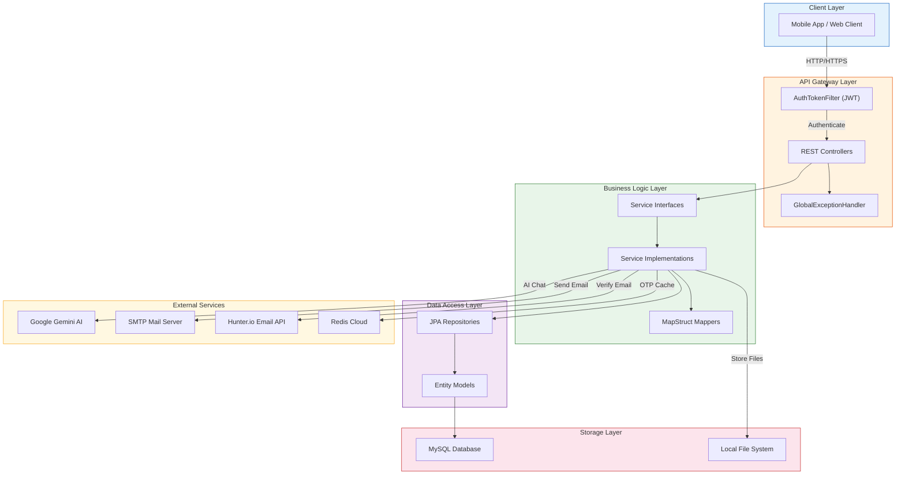
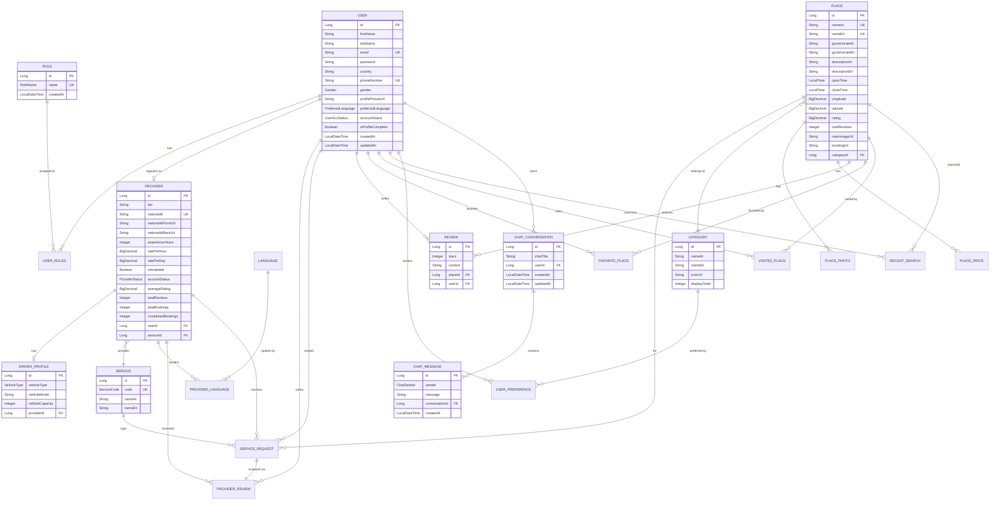
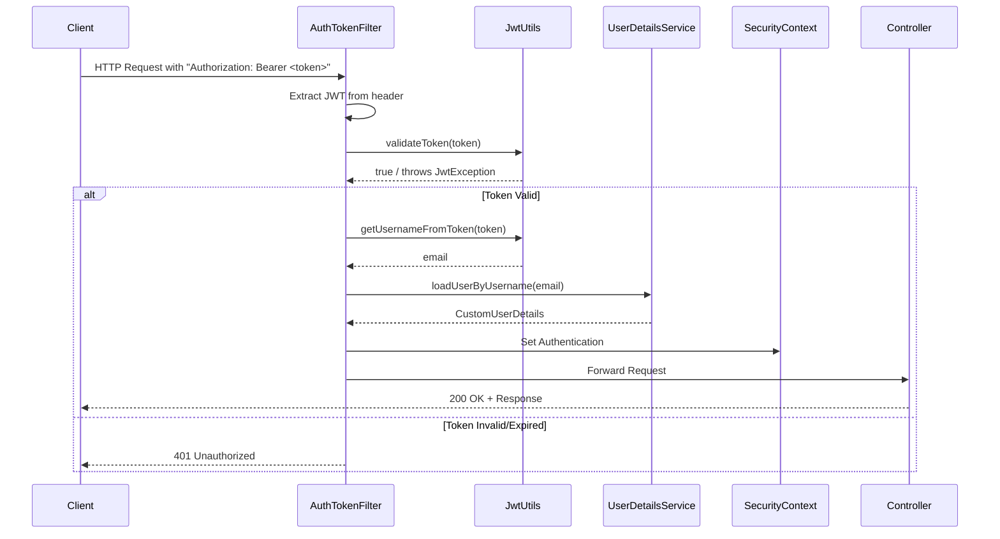
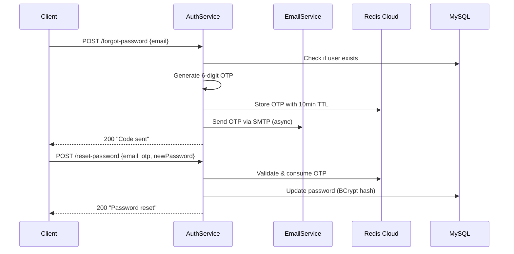

<](https://spring.io/projects/spring-boot)
[](https://openjdk.org/)
[](https://www.mysql.com/)
[](https://redis.io/)
[](https://ai.google.dev/)

</div>

---

## 📋 Table of Contents

- [Project Overview](#-project-overview)
- [Features](#-features)
- [Technology Stack](#-technology-stack)
- [System Architecture](#-system-architecture)
- [Project Structure](#-project-structure)
- [Database Design](#-database-design)
- [API Documentation](#-api-documentation)
- [Authentication & Security](#-authentication--security)
- [Configuration](#-configuration)
- [Installation](#-installation)
- [Testing](#-testing)
- [Logging & Monitoring](#-logging--monitoring)
- [External Integrations](#-external-integrations)
- [Design Patterns](#-design-patterns)
- [Performance Considerations](#-performance-considerations)
- [Deployment](#-deployment)
- [Known Issues](#-known-issues)
- [Future Improvements](#-future-improvements)
- [Contributing](#-contributing)
- [License](#-license)

---

## 🌍 Project Overview

**Sawah** (سواح — Arabic for "Tourists") is a full-featured tourism platform backend API designed to serve the Egyptian tourism market. The platform bridges the gap between tourists visiting Egypt and local service providers such as tour guides, translators, and drivers.

### Business Problem Solved

Egypt's tourism industry lacks a unified digital platform where tourists can discover places, book local service providers, and receive AI-powered travel guidance — all in a bilingual (Arabic/English) experience. Sawah solves this by providing:

- A curated, bilingual database of Egyptian tourist destinations with pricing and ratings
- A marketplace connecting tourists with verified local service providers (guides, translators, drivers)
- An AI-powered chatbot (Gemini 2.5 Flash) acting as a virtual tour guide
- An admin dashboard backend for managing the entire ecosystem

### Main Objectives

1. **Discover** — Enable tourists to browse, search, and explore Egyptian destinations by category, governorate, or popularity
2. **Connect** — Provide a verified marketplace for booking tour guides, translators, and drivers
3. **Assist** — Deliver AI-powered travel recommendations via an intelligent chatbot
4. **Manage** — Give administrators full control over users, providers, places, and platform content

### Target Users

| User Type | Description |
|-----------|-------------|
| **Tourists** | Domestic and international visitors exploring Egypt |
| **Service Providers** | Local tour guides, translators, and drivers offering their services |
| **Administrators** | Platform managers overseeing content, users, and provider approvals |

---

## ✨ Features

### 🧳 Tourist Features

- **User Registration & Authentication** — Sign up, login, and JWT-based session management
- **Profile Completion** — Multi-step profile setup with photo upload, gender, country, and phone
- **Place Discovery** — Browse places by category, governorate, popularity, or search with typeahead
- **Place Details** — View detailed place info including photos, pricing tiers, operating hours, and reviews
- **Favorite Places** — Save and manage a personal list of favorite destinations
- **Visited Places** — Track and manage visited destinations
- **Recent Searches** — Automatic tracking and management of recent place searches
- **Reviews & Ratings** — Write, update, and delete reviews for places (1–5 stars)
- **User Preferences** — Select preferred tourism categories for personalized experience
- **Provider Browsing** — Browse available service providers filtered by service type, sorted by rating or price
- **AI Chat Assistant** — Converse with an AI-powered virtual tour guide (Gemini 2.5 Flash) with conversation history
- **Password Reset** — Secure OTP-based password reset via email with Redis-backed code expiration
- **Bilingual Support** — Full Arabic and English localization via `Accept-Language` header

### 🏢 Service Provider Features

- **Provider Registration** — Submit application with national ID verification (front & back photos)
- **Profile Management** — Set bio, experience years, hourly/daily rates, and languages spoken
- **Driver Profile** — Additional vehicle details (type, model, capacity) for driver providers
- **Availability Toggle** — Toggle availability status on/off
- **Service Types** — Register as a Guide, Translator, or Driver
- **Language Proficiency** — Specify spoken languages with proficiency levels (Beginner, Intermediate, Fluent)

### 🔧 Admin Features

- **User Management** — View all users, search by email/role, activate/deactivate accounts, delete users
- **Provider Approval Workflow** — Review, approve, or reject provider applications with rejection reasons
- **Place Management** — Create places with multilingual content, multiple photos, and tiered pricing
- **Category Management** — CRUD operations on place categories with icon upload
- **Service Management** — CRUD operations on service types offered on the platform
- **Language Management** — CRUD operations on supported languages
- **Dashboard Data** — Paginated views of providers filtered by status, service code, and availability

### ⚙️ System Features

- **JWT Authentication** — Stateless token-based auth with role-based access control
- **Redis Caching** — Cloud Redis for cache and OTP storage with configurable TTL
- **Email Service** — Async SMTP email delivery for password reset OTPs
- **Email Verification** — Hunter.io API integration for validating email existence at sign-up
- **File Storage** — Local filesystem-based image storage for user photos, category icons, place photos, and national IDs
- **Internationalization (i18n)** — Full message localization for English and Arabic with `Accept-Language` header resolution
- **OpenAPI Documentation** — Swagger UI auto-generated API docs
- **Input Validation** — Bean Validation (Jakarta) with localized error messages
- **Global Exception Handling** — Centralized error handling with localized responses
- **Data Initialization** — Automatic seeding of roles, admin user, languages, categories, and services on startup
- **CORS Configuration** — Configurable cross-origin settings
- **Pagination** — Spring Data paginated responses with configurable max page size (100)

---

## 🛠️ Technology Stack

| Category | Technology |
|----------|------------|
| **Language** | Java 17 |
| **Framework** | Spring Boot 3.5.14 |
| **Database** | MySQL 8.x |
| **ORM** | Spring Data JPA / Hibernate |
| **Caching** | Redis (Cloud — Redis Labs) |
| **Security** | Spring Security 6, JWT (jjwt 0.11.5), BCrypt |
| **AI Integration** | Spring AI 1.1.5 + Google Gemini 2.5 Flash |
| **API Documentation** | SpringDoc OpenAPI 2.8.5 (Swagger UI) |
| **Email** | Spring Boot Starter Mail (SMTP) |
| **Email Validation** | Hunter.io Email Verifier API |
| **HTTP Client** | Spring WebFlux (WebClient) |
| **Object Mapping** | MapStruct 1.5.5.Final |
| **Boilerplate Reduction** | Lombok 1.18.30 |
| **Validation** | Jakarta Bean Validation |
| **Build Tool** | Maven (with Maven Wrapper) |
| **Containerization** | Not identifiable from the codebase |
| **CI/CD** | Not identifiable from the codebase |
| **Cloud** | Redis Labs (Redis Cloud), Ngrok (tunnel) |

### Spring Boot Starters

| Starter | Purpose |
|---------|---------|
| `spring-boot-starter-web` | REST API, embedded Tomcat |
| `spring-boot-starter-data-jpa` | JPA/Hibernate ORM |
| `spring-boot-starter-security` | Authentication & authorization |
| `spring-boot-starter-validation` | Jakarta Bean Validation |
| `spring-boot-starter-mail` | SMTP email sending |
| `spring-boot-starter-data-redis` | Redis cache & data store |
| `spring-boot-starter-webflux` | Reactive WebClient for external API calls |
| `spring-boot-starter-test` | Testing framework |
| `spring-ai-starter-model-google-genai` | Google Gemini AI integration |

---

## 🏗️ System Architecture

Sawah follows a **layered (N-tier) architecture** with clear separation of concerns. The application is built as a monolithic Spring Boot REST API with the following layers:

| Layer | Responsibility |
|-------|---------------|
| **Controller** | HTTP request handling, input validation, response formatting |
| **Service** | Business logic, transaction management, orchestration |
| **Repository** | Data access via Spring Data JPA |
| **Model/Entity** | Domain objects mapped to database tables |
| **DTO/Request/Response** | Data transfer objects for API contracts |
| **Mapper** | MapStruct-based entity ↔ DTO conversion |
| **Security** | JWT filter chain, user details, authentication |
| **Config** | Application-wide configuration beans |
| **Exception** | Centralized error handling with i18n |



---

## 📁 Project Structure

```text
sawah-backend/
├── .github/                          # GitHub configuration
├── .mvn/                             # Maven Wrapper files
├── category_icons/                   # Uploaded category icon images
├── place_photos/                     # Uploaded place photo images
├── providers/                        # Provider national ID documents
├── user_photos/                      # Uploaded user profile photos
├── src/
│   ├── main/
│   │   ├── java/com/sawah/sawah_backend/
│   │   │   ├── SawahApplication.java         # Application entry point
│   │   │   ├── config/                       # Configuration classes
│   │   │   │   ├── AppConfig.java            # CORS, OpenAPI, Locale, PasswordEncoder, Pageable
│   │   │   │   ├── DataInitializer.java      # Startup data seeding (roles, admin, etc.)
│   │   │   │   ├── RedisConfig.java          # Redis cache configuration
│   │   │   │   ├── SecurityConfig.java       # Spring Security filter chain
│   │   │   │   └── WebConfig.java            # Static resource handlers
│   │   │   ├── controller/                   # REST API controllers (13 controllers)
│   │   │   │   ├── AuthController.java       # Login, sign-up, password reset
│   │   │   │   ├── CategoryController.java   # Category CRUD
│   │   │   │   ├── ChatController.java       # AI chat conversations & messages
│   │   │   │   ├── FavoritePlaceController.java  # Favorite place management
│   │   │   │   ├── LanguageController.java   # Language CRUD
│   │   │   │   ├── PlaceController.java      # Place discovery & management
│   │   │   │   ├── ProviderController.java   # Provider registration & management
│   │   │   │   ├── RecentSearchController.java   # Recent search tracking
│   │   │   │   ├── ReviewController.java     # Place review CRUD
│   │   │   │   ├── ServicesController.java   # Service type CRUD
│   │   │   │   ├── UserController.java       # User profile & admin management
│   │   │   │   ├── UserPreferencesController.java  # User interest preferences
│   │   │   │   └── VisitedPlaceController.java     # Visited place tracking
│   │   │   ├── dto/                          # Data Transfer Objects (16 sub-packages)
│   │   │   ├── enums/                        # Enum types (14 enums)
│   │   │   ├── exceptions/                   # Custom exceptions & global handler
│   │   │   ├── helper/                       # Utility classes (email verification, OTP)
│   │   │   ├── mapper/                       # MapStruct mappers (15 mappers)
│   │   │   ├── models/                       # JPA entity models (21 entities)
│   │   │   ├── repository/                   # Spring Data JPA repositories (20 repos)
│   │   │   ├── requests/                     # Request body DTOs
│   │   │   ├── response/                     # API response wrappers
│   │   │   ├── security/                     # Security components
│   │   │   │   ├── jwt/                      # JWT utilities & token filter
│   │   │   │   └── user/                     # UserDetails implementation
│   │   │   └── service/                      # Business logic services (23 sub-packages)
│   │   └── resources/
│   │       ├── application.properties        # Application configuration
│   │       └── i18n/                         # Internationalization messages
│   │           ├── messages.properties       # English messages
│   │           └── messages_ar.properties    # Arabic messages
│   └── test/                                 # Test directory (empty)
├── pom.xml                                   # Maven build configuration
├── mvnw / mvnw.cmd                           # Maven Wrapper scripts
└── README.md                                 # This file
```

### Package Descriptions

| Package | Description |
|---------|-------------|
| `config` | Application-wide beans: security filter chain, CORS, Redis, OpenAPI, locale, data seeding |
| `controller` | 13 REST controllers handling all API endpoints with validation and i18n |
| `dto` | 16 sub-packages of Data Transfer Objects organized by domain entity |
| `enums` | 14 enums defining roles, statuses, genders, vehicle types, languages, service codes |
| `exceptions` | 9 custom exception classes + `GlobalExceptionHandler` with localized error responses |
| `helper` | Utility services: email verification via Hunter.io, OTP generation |
| `mapper` | 15 MapStruct interfaces for entity ↔ DTO mapping |
| `models` | 21 JPA entities representing the database schema |
| `repository` | 20 Spring Data JPA repositories with custom query methods |
| `requests` | Request body DTOs (login, registration, chat, etc.) |
| `response` | Standardized `ApiResponse<T>` and `AuthResponse` wrappers |
| `security` | JWT token utilities, `AuthTokenFilter`, `CustomUserDetails/Service` |
| `service` | 23 sub-packages with interface + implementation pairs for all business logic |

---

## 🗃️ Database Design

The application uses **MySQL** with **Hibernate DDL auto-update** mode. The schema consists of **17 primary tables** with well-defined relationships, indexes, and constraints.

### Entities Summary

| Entity | Table | Description |
|--------|-------|-------------|
| `User` | `users` | Platform users (tourists, providers, admins) |
| `Role` | `roles` | Authorization roles (TOURIST, PROVIDER, ADMIN) |
| `Provider` | `providers` | Service provider profiles linked to users |
| `DriverProfile` | `driver_profile` | Vehicle details for driver-type providers |
| `Service` | `services` | Service types (GUIDE, TRANSLATOR, DRIVER) |
| `ServiceRequest` | `service_requests` | Tourist-to-provider booking requests |
| `ProviderLanguage` | `provider_languages` | Languages spoken by providers with proficiency |
| `ProviderReview` | `provider_reviews` | Tourist reviews of providers |
| `Language` | `languages` | Available languages in the system |
| `Place` | `places` | Tourist destinations with bilingual data |
| `PlacePhoto` | `place_photos` | Multiple photos per place |
| `PlacePrice` | `place_prices` | Tiered pricing by visitor category & nationality |
| `Category` | `categories` | Place categories (e.g., Temples, Beaches) |
| `Review` | `reviews` | Tourist reviews of places (1–5 stars) |
| `FavoritePlace` | `favorite_places` | User-place favorite bookmarks |
| `VisitedPlace` | `visited_places` | User-place visit tracking |
| `RecentSearch` | `recent_searches` | User search history |
| `UserPreference` | `user_preferences` | User category interest preferences |
| `ChatConversation` | `chat_conversations` | AI chat conversation sessions |
| `ChatMessage` | `chat_messages` | Individual messages within conversations |

### Entity-Relationship Diagram



### Key Database Constraints

- **Unique Constraints**: `user.email`, `user.phone_number`, `provider.national_id`, `place.name_en`, `place.name_ar`, `language.code`, `service.service_code`
- **Composite Unique**: `review(place_id, user_id)`, `favorite_place(user_id, place_id)`, `visited_place(user_id, place_id)`, `provider_language(provider_id, language_id)`
- **Cascade Deletes**: Reviews, favorites, visited places, recent searches, chat conversations, and chat messages cascade on user/place deletion
- **Indexes**: `idx_user_email`, `idx_user_phone`, `idx_provider_nationalId`, `uq_places_name_en`, `uq_places_name_ar`

---

## 📡 API Documentation

> **Base URL**: `http://localhost:9091/api/v1`
>
> **Swagger UI**: `http://localhost:9091/swagger-ui.html`

### Authentication Endpoints

| Method | Path | Description | Auth | Role |
|--------|------|-------------|------|------|
| `POST` | `/auth/login` | Authenticate user and receive JWT | ❌ | Any |
| `POST` | `/auth/sign-up` | Register new tourist account | ❌ | Any |
| `POST` | `/auth/provider/sign-up` | Register new provider account | ❌ | Any |
| `POST` | `/auth/forgot-password` | Initiate OTP-based password reset | ❌ | Any |
| `POST` | `/auth/reset-password` | Reset password using OTP code | ❌ | Any |

<details>
<summary><strong>📝 Auth API Details</strong></summary>

#### `POST /auth/login`

**Request Body:**
```json
{
  "email": "user@example.com",
  "password": "securepassword"
}
```

**Response (200):**
```json
{
  "message": "Logged in successfully.",
  "token": "eyJhbGciOiJIUzI1NiJ9...",
  "isProfileComplete": true,
  "roles": ["ROLE_TOURIST"],
  "timestamp": "2026-05-31T20:00:00",
  "providerStatus": null,
  "rejectionReason": null
}
```

#### `POST /auth/sign-up`

**Request Body:**
```json
{
  "firstName": "John",
  "lastName": "Doe",
  "email": "john@example.com",
  "password": "securepassword123"
}
```

**Response (201):**
```json
{
  "message": "User added successfully to the system",
  "data": null,
  "timestamp": "2026-05-31T20:00:00"
}
```

#### `POST /auth/forgot-password`

**Request Body:**
```json
{
  "email": "user@example.com"
}
```

#### `POST /auth/reset-password`

**Request Body:**
```json
{
  "email": "user@example.com",
  "otp": "123456",
  "newPassword": "newSecurePassword"
}
```

</details>

---

### User Endpoints

| Method | Path | Description | Auth | Role |
|--------|------|-------------|------|------|
| `GET` | `/users` | Get all users (paginated) | ✅ | ADMIN |
| `GET` | `/users/{id}` | Get user by ID | ✅ | ADMIN |
| `GET` | `/users/search?role=&email=` | Search users by role or email | ✅ | ADMIN |
| `GET` | `/users/me` | Get current user profile | ✅ | TOURIST |
| `PUT` | `/users/me` | Update current user profile (multipart) | ✅ | TOURIST, PROVIDER |
| `PUT` | `/users/complete-profile` | Complete tourist profile (multipart) | ✅ | TOURIST |
| `PATCH` | `/users/change-password` | Change password | ✅ | TOURIST, PROVIDER |
| `PATCH` | `/users/preferred-language` | Toggle preferred language (EN/AR) | ✅ | Any authenticated |
| `PATCH` | `/users/{id}/account-status` | Toggle user account active/inactive | ✅ | ADMIN |
| `DELETE` | `/users/{id}` | Delete user by ID | ✅ | ADMIN |
| `DELETE` | `/users/me` | Delete own account | ✅ | Any authenticated |

---

### Place Endpoints

| Method | Path | Description | Auth | Role |
|--------|------|-------------|------|------|
| `GET` | `/places` | Get all places (paginated) | ✅ | ADMIN |
| `GET` | `/places/{placeId}` | Get place with full details | ✅ | Any authenticated |
| `GET` | `/places/category/{categoryId}` | Filter places by category | ✅ | Any authenticated |
| `GET` | `/places/governorate?name=` | Filter places by governorate | ✅ | Any authenticated |
| `GET` | `/places/popular` | Get places sorted by rating | ✅ | Any authenticated |
| `GET` | `/places/favorites` | Get user's favorite places | ✅ | TOURIST |
| `GET` | `/places/visited` | Get user's visited places | ✅ | TOURIST |
| `GET` | `/places/recent-searches` | Get user's recent searches | ✅ | TOURIST |
| `GET` | `/places/typeahead?q=` | Typeahead/autocomplete search | ✅ | Any authenticated |
| `POST` | `/places` | Create new place (multipart) | ✅ | ADMIN |
| `DELETE` | `/places/{id}` | Delete a place | ✅ | ADMIN |

---

### Provider Endpoints

| Method | Path | Description | Auth | Role |
|--------|------|-------------|------|------|
| `GET` | `/providers` | Get providers for tourists (filtered & sorted) | ✅ | Any authenticated |
| `GET` | `/providers/{providerId}` | Get provider with full details | ✅ | Any authenticated |
| `GET` | `/providers/{providerId}/reviews` | Get provider reviews (paginated) | ✅ | Any authenticated |
| `GET` | `/providers/admin` | Get all providers for admin (filtered) | ✅ | ADMIN |
| `GET` | `/providers/admin/{providerId}` | Get provider detail for admin | ✅ | ADMIN |
| `POST` | `/providers/register` | Submit provider application (multipart) | ✅ | PROVIDER |
| `PUT` | `/providers/complete-profile` | Complete provider profile (multipart) | ✅ | PROVIDER |
| `PUT` | `/providers/me` | Update provider profile (multipart) | ✅ | PROVIDER |
| `PATCH` | `/providers/{providerId}/approve` | Approve provider application | ✅ | ADMIN |
| `PATCH` | `/providers/{providerId}/reject?rejectionReason=` | Reject provider with reason | ✅ | ADMIN |
| `PATCH` | `/providers/me/availability` | Toggle provider availability | ✅ | PROVIDER |

---

### Chat (AI) Endpoints

| Method | Path | Description | Auth | Role |
|--------|------|-------------|------|------|
| `POST` | `/chats/messages` | Send message to AI chatbot | ✅ | TOURIST |
| `GET` | `/chats/conversations` | Get user's chat conversations | ✅ | TOURIST |
| `GET` | `/chats/conversations/{id}/messages` | Get messages in a conversation | ✅ | TOURIST |
| `PATCH` | `/chats/conversations/{id}` | Update conversation title | ✅ | TOURIST |
| `DELETE` | `/chats/conversations/{id}` | Delete a conversation | ✅ | TOURIST |

---

### Review Endpoints

| Method | Path | Description | Auth | Role |
|--------|------|-------------|------|------|
| `POST` | `/reviews/places/{placeId}` | Add a review for a place | ✅ | TOURIST |
| `PUT` | `/reviews/{id}` | Update a review | ✅ | TOURIST |
| `DELETE` | `/reviews/{id}` | Delete a review | ✅ | TOURIST |

---

### Favorite Place Endpoints

| Method | Path | Description | Auth | Role |
|--------|------|-------------|------|------|
| `POST` | `/users/favorite-places/{placeId}` | Add place to favorites | ✅ | Any authenticated |
| `DELETE` | `/users/favorite-places/{placeId}` | Remove place from favorites | ✅ | Any authenticated |

---

### Visited Place Endpoints

| Method | Path | Description | Auth | Role |
|--------|------|-------------|------|------|
| `POST` | `/users/visited-places/{placeId}` | Mark place as visited | ✅ | TOURIST |
| `DELETE` | `/users/visited-places/{placeId}` | Remove visited place | ✅ | TOURIST |

---

### Recent Search Endpoints

| Method | Path | Description | Auth | Role |
|--------|------|-------------|------|------|
| `POST` | `/users/recent-searches/{placeId}` | Add recent search | ✅ | TOURIST |
| `DELETE` | `/users/recent-searches` | Clear all recent searches | ✅ | TOURIST |

---

### User Preferences Endpoints

| Method | Path | Description | Auth | Role |
|--------|------|-------------|------|------|
| `POST` | `/users/preferences` | Save preferred category IDs | ✅ | TOURIST |
| `GET` | `/users/preferences` | Get user's preferred categories | ✅ | TOURIST |

---

### Category Endpoints

| Method | Path | Description | Auth | Role |
|--------|------|-------------|------|------|
| `GET` | `/categories` | Get all categories | ✅ | Any authenticated |
| `GET` | `/categories/{id}` | Get category by ID | ✅ | ADMIN |
| `POST` | `/categories` | Create category (multipart) | ✅ | ADMIN |
| `PUT` | `/categories/{id}` | Update category (multipart) | ✅ | ADMIN |
| `DELETE` | `/categories/{id}` | Delete category | ✅ | ADMIN |

---

### Service Endpoints

| Method | Path | Description | Auth | Role |
|--------|------|-------------|------|------|
| `GET` | `/services` | Get all services | ✅ | Any authenticated |
| `GET` | `/services/{id}` | Get service by ID | ✅ | ADMIN |
| `POST` | `/services` | Create service | ✅ | ADMIN |
| `PUT` | `/services/{id}` | Update service | ✅ | ADMIN |
| `DELETE` | `/services/{id}` | Delete service | ✅ | ADMIN |

---

### Language Endpoints

| Method | Path | Description | Auth | Role |
|--------|------|-------------|------|------|
| `GET` | `/languages` | Get all languages | ✅ | Any authenticated |
| `GET` | `/languages/{id}` | Get language by ID | ✅ | ADMIN |
| `POST` | `/languages` | Create language | ✅ | ADMIN |
| `PUT` | `/languages/{id}` | Update language | ✅ | ADMIN |
| `DELETE` | `/languages/{id}` | Delete language | ✅ | ADMIN |

---

### Standardized API Response Format

All endpoints return a consistent response wrapper:

```json
{
  "message": "Operation successful",
  "data": { ... },
  "timestamp": "2026-05-31T20:00:00"
}
```

### Status Codes

| Code | Meaning |
|------|---------|
| `200` | Success |
| `201` | Resource created |
| `400` | Bad request / validation error |
| `401` | Unauthorized / invalid credentials |
| `403` | Forbidden / insufficient permissions |
| `404` | Resource not found |
| `500` | Internal server error |

---

## 🔐 Authentication & Security

### Security Architecture

The application implements a **stateless JWT-based authentication** system with **role-based access control (RBAC)**.

#### Key Components

| Component | Description |
|-----------|-------------|
| `SecurityConfig` | Configures the security filter chain, session policy (STATELESS), and endpoint permissions |
| `AuthTokenFilter` | `OncePerRequestFilter` that extracts, validates JWT tokens, and sets the security context |
| `JwtUtils` | Generates and validates JWT tokens with HMAC-SHA signing |
| `CustomUserDetails` | Implements `UserDetails` interface wrapping the `User` entity |
| `CustomUserDetailsService` | Loads user by email from database for authentication |
| `BCryptPasswordEncoder` | Password hashing with BCrypt |

#### Roles & Permissions

| Role | Permissions |
|------|------------|
| `TOURIST` | Profile management, place browsing, reviews, favorites, visited places, AI chat, preferences |
| `PROVIDER` | Provider registration, profile management, availability toggle |
| `ADMIN` | Full CRUD on all resources, user management, provider approval/rejection |

#### Public Endpoints (No Authentication Required)

- `/api/v1/auth/**` — Login, sign-up, password reset
- `/user_photos/**`, `/category_icons/**`, `/place_photos/**` — Static file serving
- `/v3/api-docs/**`, `/swagger-ui/**` — API documentation

### Security Flow



### Password Reset Flow



### JWT Token Structure

The JWT token contains the following claims:

| Claim | Description |
|-------|-------------|
| `sub` | User email address |
| `id` | User ID |
| `roles` | Set of granted authorities (e.g., `ROLE_TOURIST`) |
| `iat` | Issued at timestamp |
| `exp` | Expiration timestamp (configurable, default: 7 days) |

---

## ⚙️ Configuration

### Environment Variables

| Variable | Required | Description |
|----------|----------|-------------|
| `DB_URL` | ✅ | MySQL JDBC connection URL (e.g., `jdbc:mysql://localhost:3306/sawah`) |
| `DB_USERNAME` | ✅ | MySQL database username |
| `DB_PASSWORD` | ✅ | MySQL database password |
| `JWT_SECRET_KEY` | ✅ | Base64-encoded HMAC secret key for JWT signing |
| `ADMIN_EMAIL` | ✅ | Default admin account email (seeded on startup) |
| `ADMIN_PASSWORD` | ✅ | Default admin account password (seeded on startup) |
| `MAIL_HOST` | ✅ | SMTP mail server host |
| `MAIL_PORT` | ✅ | SMTP mail server port |
| `MAIL_USERNAME` | ✅ | SMTP authentication username |
| `MAIL_PASSWORD` | ✅ | SMTP authentication password |
| `VALIDATE_EMAIL_API_KEY` | ⚠️ | Hunter.io API key for email verification (currently disabled in code) |
| `GEMINI_API_KEY` | ✅ | Google Gemini AI API key |

### Application Properties

| Property | Default | Description |
|----------|---------|-------------|
| `server.port` | `9091` | Application server port |
| `spring.jpa.hibernate.ddl-auto` | `update` | Auto-generate/update schema |
| `spring.jpa.show-sql` | `true` | Log SQL queries |
| `spring.cache.type` | `redis` | Cache provider |
| `spring.cache.redis.time-to-live` | `10m` | Default cache TTL |
| `spring.servlet.multipart.max-file-size` | `10MB` | Max upload file size |
| `spring.servlet.multipart.max-request-size` | `10MB` | Max request size |
| `auth.token.expiration-in-mils` | `604800000` | JWT expiration (7 days) |
| `spring.ai.google.genai.chat.options.model` | `gemini-2.5-flash` | AI model selection |
| `spring.ai.google.genai.chat.options.temperature` | `0.7` | AI creativity level |
| `api.prefix` | `/api/v1` | API route prefix |

---

## 🚀 Installation

### Prerequisites

- **Java 17** (JDK)
- **MySQL 8.x** running instance
- **Redis** server or cloud instance
- **Maven 3.9+** (or use included Maven Wrapper)

### 1. Clone the Repository

```bash
git clone https://github.com/your-username/sawah-backend.git
cd sawah-backend
```

### 2. Create MySQL Database

```sql
CREATE DATABASE sawah_db CHARACTER SET utf8mb4 COLLATE utf8mb4_unicode_ci;
```

### 3. Set Environment Variables

Create a `.env` file or set system environment variables:

```bash
# Database
export DB_URL=jdbc:mysql://localhost:3306/sawah_db?useSSL=false&serverTimezone=UTC
export DB_USERNAME=root
export DB_PASSWORD=your_mysql_password

# JWT
export JWT_SECRET_KEY=your_base64_encoded_secret_key_min_256_bits

# Admin Account (seeded on first startup)
export ADMIN_EMAIL=admin@sawah.com
export ADMIN_PASSWORD=AdminSecurePassword123

# Email (SMTP)
export MAIL_HOST=smtp.gmail.com
export MAIL_PORT=587
export MAIL_USERNAME=your_email@gmail.com
export MAIL_PASSWORD=your_app_password

# Email Verification (optional)
export VALIDATE_EMAIL_API_KEY=your_hunter_io_api_key

# AI
export GEMINI_API_KEY=your_google_gemini_api_key
```

### 4. Build the Project

```bash
# Using Maven Wrapper (recommended)
./mvnw clean install -DskipTests

# Or using system Maven
mvn clean install -DskipTests
```

### 5. Run the Application

```bash
# Using Maven Wrapper
./mvnw spring-boot:run

# Or using the JAR
java -jar target/sawah-backend-0.0.1-SNAPSHOT.jar
```

### 6. Verify

- **API**: `http://localhost:9091/api/v1/auth/login`
- **Swagger UI**: `http://localhost:9091/swagger-ui.html`
- **OpenAPI Spec**: `http://localhost:9091/v3/api-docs`

---

## 🐳 Docker

Not identifiable from the codebase. No `Dockerfile` or `docker-compose.yml` was found in the repository.

To containerize, a Dockerfile like the following could be added:

```dockerfile
FROM eclipse-temurin:17-jre-alpine
WORKDIR /app
COPY target/sawah-backend-0.0.1-SNAPSHOT.jar app.jar
EXPOSE 9091
ENTRYPOINT ["java", "-jar", "app.jar"]
```

---

## 🧪 Testing

The `src/test/` directory is currently **empty**. No unit tests, integration tests, or test configurations were found.

### Testing Framework (Available via Dependencies)

The project includes `spring-boot-starter-test` which bundles:
- **JUnit 5** — Unit testing framework
- **Mockito** — Mocking framework
- **Spring Test** — Integration testing support
- **AssertJ** — Fluent assertions

### How to Run Tests (When Added)

```bash
# Run all tests
./mvnw test

# Run with coverage report
./mvnw test jacoco:report
```

---

## 📊 Logging & Monitoring

### Logging Configuration

| Logger | Level | Purpose |
|--------|-------|---------|
| `org.hibernate.orm.jdbc.bind` | `TRACE` | Log Hibernate parameter bindings |
| `org.springframework.cache` | `TRACE` | Log cache operations |
| `org.springframework.data.redis` | `TRACE` | Log Redis operations |

### Logging Framework

The application uses **SLF4J** with **Logback** (Spring Boot default). JWT-related events are logged via the `@Slf4j` annotation on `JwtUtils`:
- Token expiration warnings
- Invalid JWT errors

### Health Checks & Monitoring

Not identifiable from the codebase. Spring Boot Actuator is not included as a dependency. For production, adding `spring-boot-starter-actuator` is recommended.

---

## 🔌 External Integrations

### 1. Google Gemini AI (Spring AI)

| Detail | Value |
|--------|-------|
| **Purpose** | AI-powered tourism chatbot |
| **Model** | `gemini-2.5-flash` |
| **Library** | Spring AI 1.1.5 (`spring-ai-starter-model-google-genai`) |
| **Features** | Bilingual responses (Arabic/English), auto-title generation, tourism context awareness |
| **Temperature** | `0.7` (balanced creativity) |

The AI service (`GeminiServiceImpl`) acts as a virtual tour guide, automatically detecting the user's language and responding accordingly. It generates 3-word conversation titles from the first message.

### 2. SMTP Email Service

| Detail | Value |
|--------|-------|
| **Purpose** | Password reset OTP delivery |
| **Protocol** | SMTP with STARTTLS |
| **Features** | Async sending via `@Async`, localized subjects and bodies |
| **Configuration** | Via environment variables (`MAIL_HOST`, `MAIL_PORT`, etc.) |

### 3. Hunter.io Email Verification

| Detail | Value |
|--------|-------|
| **Purpose** | Validate email existence during registration |
| **Client** | Spring WebFlux `WebClient` |
| **API** | `https://api.hunter.io/v2/email-verifier` |
| **Status** | Currently **disabled** in code (commented out in `AuthServiceImpl`) |

### 4. Redis Cloud (Redis Labs)

| Detail | Value |
|--------|-------|
| **Purpose** | OTP storage with TTL, general caching |
| **Provider** | Redis Labs Cloud |
| **TTL** | 10 minutes (configurable) |
| **Serialization** | JSON via `RedisSerializer.json()` |

---

## 🎨 Design Patterns

### 1. Dependency Injection (IoC)

Used extensively throughout the application via Spring's `@RequiredArgsConstructor` (Lombok) and constructor injection. Every controller, service, and security component uses constructor-based DI.

### 2. Repository Pattern

All data access is abstracted through Spring Data JPA repository interfaces (20 repositories), providing a clean separation between business logic and data persistence.

### 3. Service Layer Pattern

Each domain concept has a service interface and implementation pair (e.g., `UserService` / `UserServiceImpl`), ensuring loose coupling and testability.

### 4. DTO (Data Transfer Object) Pattern

Extensive use of DTOs (16 sub-packages) with MapStruct mappers to decouple the API layer from internal entity models. Separate DTOs exist for input, response, and admin views.

### 5. Builder Pattern

All JPA entities use the Lombok `@Builder` annotation, enabling fluent object construction with sensible defaults (e.g., `accountStatus = ACTIVE`, `rating = ZERO`).

### 6. Strategy Pattern

The `AiChatService` interface with its `GeminiServiceImpl` implementation follows the Strategy pattern, allowing the AI provider to be swapped without changing consumer code.

### 7. Template Method Pattern

The `OncePerRequestFilter` extension in `AuthTokenFilter` follows the Template Method pattern, with the framework calling `doFilterInternal()`.

### 8. Observer Pattern (Event-Driven)

The `@Async` email service acts as an asynchronous event handler for password reset events, decoupling email delivery from the main request flow.

### 9. Singleton Pattern

All Spring beans are singletons by default. Configuration classes (`SecurityConfig`, `RedisConfig`, `AppConfig`) produce singleton beans.

### 10. Centralized Exception Handling

The `GlobalExceptionHandler` uses `@RestControllerAdvice` to provide a cross-cutting concern for error handling across all controllers.

---

## ⚡ Performance Considerations

### Caching (Redis)

- **Cache Provider**: Redis Cloud with 10-minute TTL
- **Usage**: General caching layer configured via `spring.cache.type=redis`
- **OTP Storage**: Redis-backed OTP with 10-minute expiration for password resets

### Pagination

- All list endpoints return `Page<T>` responses with configurable page size
- Default page size: 20 items
- Maximum page size: 100 items (enforced via `PageableHandlerMethodArgumentResolverCustomizer`)
- Zero-indexed pagination (`oneIndexedParameters = false`)

### Database Optimization

- **Indexes**: Strategic database indexes on frequently queried columns (`email`, `phone_number`, `national_id`, `name_en`, `name_ar`)
- **Lazy Loading**: All `@ManyToOne` and `@OneToOne` associations use `FetchType.LAZY` to prevent N+1 queries
- **Eager Roles**: `User.roles` uses `FetchType.EAGER` since roles are needed for every authentication check

### Async Processing

- **Email Sending**: `@Async` annotation on `EmailServiceImpl.sendVerificationCode()` with `@EnableAsync` in `AppConfig`
- This prevents email delivery from blocking the HTTP request thread

### File Upload Limits

- Maximum file size: 10MB
- Maximum request size: 10MB

---

## 🚢 Deployment

### Production Considerations

1. **Database**: Switch `spring.jpa.hibernate.ddl-auto` from `update` to `validate` or `none`
2. **SQL Logging**: Set `spring.jpa.show-sql=false` and reduce Hibernate bind logging
3. **Redis**: The application is already configured with Redis Cloud (Redis Labs)
4. **CORS**: Restrict `allowedOriginPatterns` from `*` to specific frontend domains
5. **Tunneling**: The project includes Ngrok server URL in OpenAPI config for development; remove for production
6. **Redis Credentials**: Move hardcoded Redis credentials to environment variables
7. **Secret Management**: Ensure `JWT_SECRET_KEY` is strong and stored securely

### Build Artifacts

```bash
# Generate production JAR
./mvnw clean package -DskipTests

# Output: target/sawah-backend-0.0.1-SNAPSHOT.jar
```

### Run in Production

```bash
java -jar target/sawah-backend-0.0.1-SNAPSHOT.jar \
  --spring.profiles.active=prod \
  --server.port=8080
```

---

## ⚠️ Known Issues

1. **Hardcoded Redis Credentials** — Redis Cloud credentials (host, port, password) are hardcoded in `application.properties` instead of being externalized to environment variables. This is a **security risk**.

2. **Empty Test Suite** — The `src/test/` directory is empty. No unit tests, integration tests, or test configurations exist.

3. **Email Verification Disabled** — The Hunter.io email verification during sign-up is commented out in `AuthServiceImpl`, meaning any email format can register.

4. **No Dockerfile** — No containerization configuration exists, making deployment less portable.

5. **Hardcoded Ngrok URL** — The OpenAPI server configuration contains a hardcoded Ngrok URL that will expire and should be dynamized.

6. **SQL Logging in Production** — `spring.jpa.show-sql=true` and `TRACE` level logging for Hibernate, Cache, and Redis are enabled, which would cause excessive log output in production.

7. **No Rate Limiting** — No API rate limiting is configured, making endpoints vulnerable to abuse.

8. **Local File Storage** — Images are stored on the local filesystem, which does not scale for distributed deployments. A cloud storage solution (S3, GCS) would be more appropriate.

9. **No Input Sanitization for AI** — User prompts sent to the Gemini AI model are not sanitized for prompt injection attacks.

10. **CORS Wide Open** — `allowedOriginPatterns("*")` permits requests from any origin with credentials enabled.

---

## 🔮 Future Improvements

1. **Cloud File Storage** — Migrate from local filesystem to AWS S3 or Google Cloud Storage for scalable image hosting
2. **API Rate Limiting** — Implement request throttling with Spring Cloud Gateway or Bucket4j
3. **WebSocket Chat** — Add real-time communication using WebSockets for the AI chatbot
4. **Comprehensive Test Suite** — Add unit tests (JUnit 5 + Mockito), integration tests, and API tests with test coverage
5. **Docker & Docker Compose** — Containerize the application with MySQL and Redis services
6. **CI/CD Pipeline** — Configure GitHub Actions for automated testing, building, and deployment
7. **Spring Actuator** — Add health checks, metrics, and monitoring endpoints
8. **API Versioning** — Formalize API versioning strategy beyond the URL prefix
9. **Push Notifications** — Notify providers of new service requests and tourists of status updates
10. **Payment Integration** — Add payment gateway (Stripe, PayMob) for service bookings
11. **Geolocation Search** — Implement proximity-based place search using MySQL spatial queries
12. **Profile Completion Tracking** — Add completion percentage for tourist and provider profiles
13. **Admin Analytics Dashboard** — Backend endpoints for platform statistics and reporting
14. **Externalize Redis Config** — Move Redis credentials to environment variables
15. **Audit Logging** — Track user actions for compliance and debugging

---

## 🤝 Contributing

Contributions are welcome! Please follow these guidelines:

### Getting Started

1. **Fork** the repository
2. **Clone** your fork locally
3. **Create a branch** for your feature/fix:
   ```bash
   git checkout -b feature/your-feature-name
   ```
4. **Make changes** and commit with clear messages:
   ```bash
   git commit -m "feat: add endpoint for provider statistics"
   ```
5. **Push** to your fork and open a **Pull Request**

### Code Standards

- Follow existing package and naming conventions
- Use **Lombok** annotations consistently (`@RequiredArgsConstructor`, `@Builder`, `@Getter/@Setter`)
- Create **interface + implementation** pairs for new services
- Use **MapStruct** mappers for entity ↔ DTO conversion
- Add **i18n** messages for both English and Arabic (`messages.properties`, `messages_ar.properties`)
- Use **Jakarta Validation** annotations with message keys for request validation
- Write **meaningful commit messages** following [Conventional Commits](https://www.conventionalcommits.org/)

### Pull Request Checklist

- [ ] Code compiles without errors
- [ ] Existing functionality is not broken
- [ ] New endpoints are documented with Swagger annotations
- [ ] i18n messages added for both languages
- [ ] DTOs created for request/response objects

---

## 📄 License

Not identifiable from the codebase. No `LICENSE` file was found in the repository.

> It is recommended to add a license file (e.g., MIT, Apache 2.0) to clarify usage rights.

---

<div align="center">

**Built with ❤️ for Egypt's Tourism Industry**

*Sawah — Your Gateway to Exploring Egypt*

</div>
]]>
