<p align="center">
  <h1 align="center">🧭 Sawah Backend</h1>
  <p align="center">
    <strong>The intelligent tourism platform that connects travelers with local guides, translators & drivers — powered by AI.</strong>
  </p>
  <p align="center">
    <a href="#"></a>
    <a href="#"></a>
    <a href="#"></a>
    <a href="#"></a>
    <a href="#"></a>
    <a href="#"></a>
    <a href="#"></a>
    <a href="#"></a>
  </p>
</p>

---

## 📖 Overview

**Sawah** (سواح — Arabic for "Travelers") is a full-stack smart tourism platform designed to revolutionize how tourists explore destinations. The backend serves as the core API layer, orchestrating everything from AI-powered travel conversations to real-time booking notifications and intelligent landmark recognition.

### The Problem

Tourists in new destinations struggle to find reliable local guides, translators, and drivers. Language barriers, overpricing, and lack of personalized recommendations make travel planning stressful and fragmented.

### The Solution

Sawah brings together **AI intelligence**, **real-time communication**, and a **marketplace of verified local service providers** into a single, elegant API — enabling tourists to discover places, book services, and get AI-powered travel assistance in their preferred language.

---

## 🏗️ System Architecture

### Context Diagram

<p align="center">
  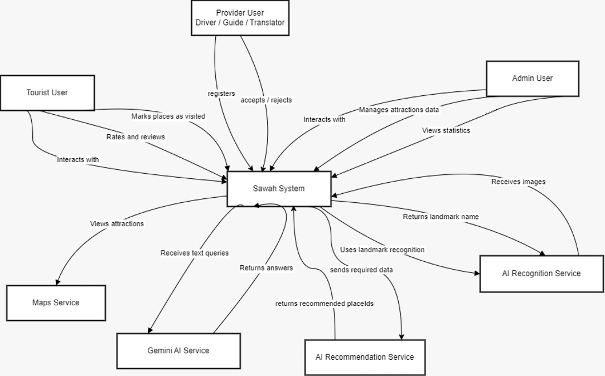
</p>

> The Sawah system sits at the center, integrating with **Tourist Users**, **Provider Users** (Driver / Guide / Translator), **Admin Users**, and four external AI/ML services: **Gemini AI**, **AI Recognition**, **AI Recommendation**, and **Maps Service**.

### High-Level Architecture

<p align="center">
  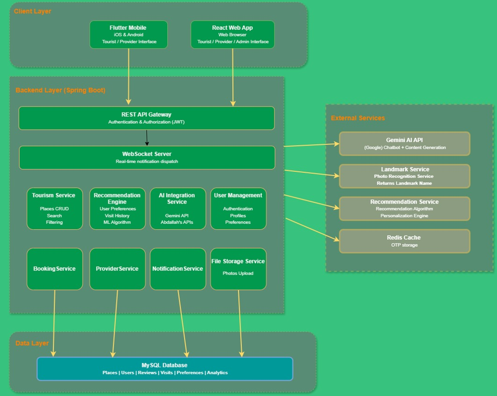
</p>

| Layer | Technology | Purpose |
|-------|-----------|---------|
| **Client Layer** | Flutter Mobile (iOS & Android) + React Web App | Tourist / Provider / Admin interfaces |
| **API Gateway** | Spring Boot 3.5 + Spring Security | REST API, JWT auth, method-level RBAC |
| **Real-Time** | WebSocket + STOMP + SockJS | Push notifications for booking updates |
| **AI / ML** | Spring AI + Gemini 2.5 Flash | Chatbot, landmark info generation |
| **ML Microservice** | FastAPI (Python) | Landmark image recognition (CNN), place recommendations |
| **Persistence** | MySQL + Spring Data JPA | Primary relational storage |
| **Caching** | Redis | Response caching with 10-minute TTL, OTP storage |
| **Email** | Spring Mail + SMTP | OTP delivery, password reset flows |

---

## 📊 Database Design (ERD)

<p align="center">
  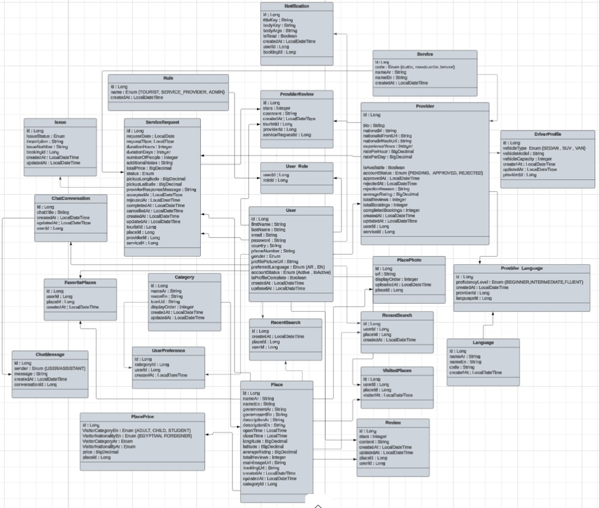
</p>

The database consists of **24 entities** including:

| Entity Group | Tables | Key Relationships |
|-------------|--------|-------------------|
| **Users & Auth** | `User`, `Role`, `UserRole`, `RefreshToken` | Many-to-Many roles, one-to-one refresh tokens |
| **Providers** | `Provider`, `DriverProfile`, `ProviderLanguage`, `ProviderReview` | One-to-One with User, Many-to-One with Service |
| **Places** | `Place`, `PlacePhoto`, `PlacePrice`, `Category` | Multi-photo support, visitor-type pricing |
| **Bookings** | `ServiceRequest`, `Service` | Full lifecycle with status tracking |
| **Discovery** | `FavoritePlace`, `VisitedPlace`, `RecentSearch`, `UserPreference` | Per-user personalization |
| **Communication** | `ChatConversation`, `ChatMessage`, `Notification` | AI chat history, push notifications |
| **Moderation** | `Issue`, `Review`, `Language` | Platform management, i18n support |

---

## ✨ Core Features

### 🔐 Authentication & Security
- **JWT-based authentication** with access token + refresh token rotation
- **Google OAuth 2.0** sign-in with support for both web and mobile client IDs
- **Role-Based Access Control (RBAC)** with three roles: `TOURIST`, `PROVIDER`, `ADMIN`
- **BCrypt password hashing** with secure password reset flow via email OTP
- **Method-level security** with `@PreAuthorize` annotations across all 18 controllers
- **Stateless session management** — zero server-side sessions, pure JWT
- **Email validation API** integration for verifying user email addresses
- **Account status management** — Admin can activate/deactivate user accounts

### 🤖 AI-Powered Intelligence

#### AI Travel Chatbot
- Conversational AI powered by **Gemini 2.5 Flash** via Spring AI
- Context-aware responses — detects first message for warm welcome, then switches to concise answers
- **Auto-generated conversation titles** — AI summarizes the first message into a catchy 3-word title
- Full conversation management: create, list, rename, delete conversations
- **Bilingual support** — automatically responds in the same language as the user's prompt (Arabic / English)

<p align="center">
  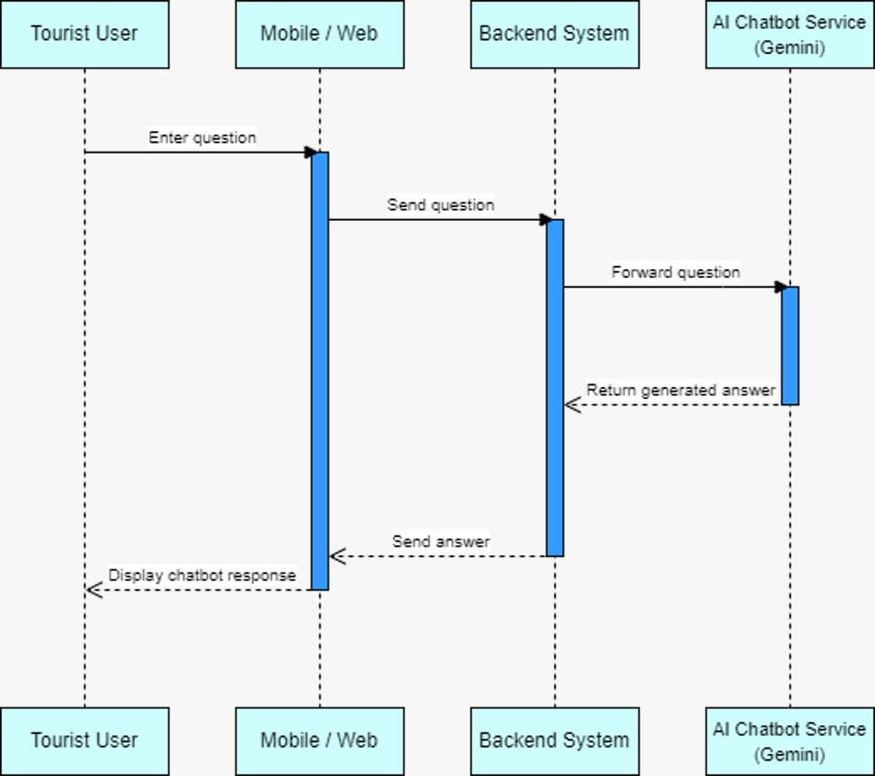
</p>

<p align="center">
  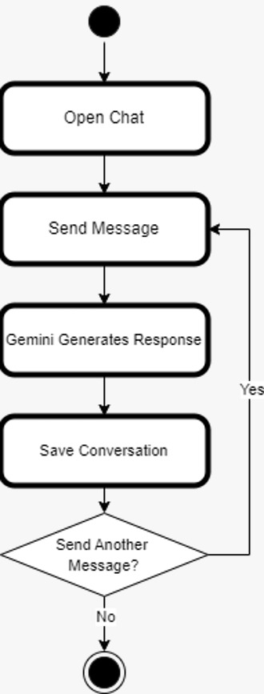
</p>

#### AI Landmark Recognition
- **Upload a photo** → FastAPI CNN model identifies the landmark name → Gemini generates rich, localized tourist information
- Two-stage AI pipeline: image classification (FastAPI `/api/predict`) + content generation (Gemini)
- Response language is driven by the `Accept-Language` header — Arabic or English
- Returns structured JSON with detailed landmark information

<p align="center">
  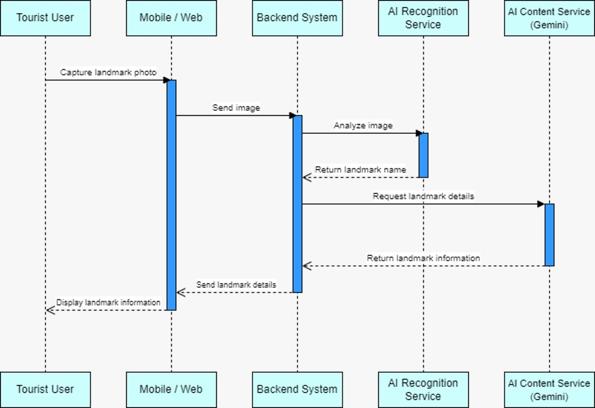
</p>

<p align="center">
  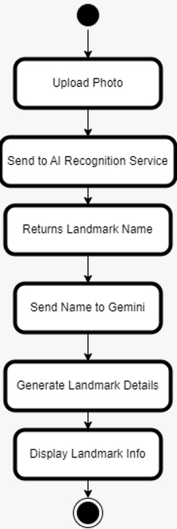
</p>

#### Smart Recommendations
- ML-based place recommendation engine served via the FastAPI microservice (`/api/recommend`)
- Personalized based on user preferences and visit history
- Integrated directly into the Places API (`GET /places/recommendations`)

### 📍 Places & Discovery

A comprehensive place discovery engine with multiple access patterns:

| Feature | Endpoint | Description |
|---------|---------|-------------|
| **Browse by Category** | `GET /places/category/{id}` | Filter places by category (historical, beach, etc.) |
| **Browse by Governorate** | `GET /places/governorate?name=` | Region-based filtering (Arabic & English) |
| **Typeahead Search** | `GET /places/typeahead?q=` | Real-time search suggestions as user types |
| **Popular Places** | `GET /places/popular` | Sorted by highest average rating |
| **Nearby Places** | `GET /places/nearby?lat=&lng=` | Location-aware — returns top 5 nearest places |
| **Map Bounds** | `POST /places/within-bounds` | Returns all places within map viewport coordinates |
| **Recommendations** | `GET /places/recommendations` | AI-powered personalized recommendations |
| **Favorites** | `GET /places/favorites` | User's saved favorite places |
| **Visited History** | `GET /places/visited` | Places the user has marked as visited |
| **Recent Searches** | `GET /places/recent-searches` | Recall of recent search activity |
| **Place Details** | `GET /places/{id}` | Full place detail with photos, pricing, reviews |
| **Admin CRUD** | `POST/PUT/DELETE /places` | Multipart form data with image uploads |

<p align="center">
  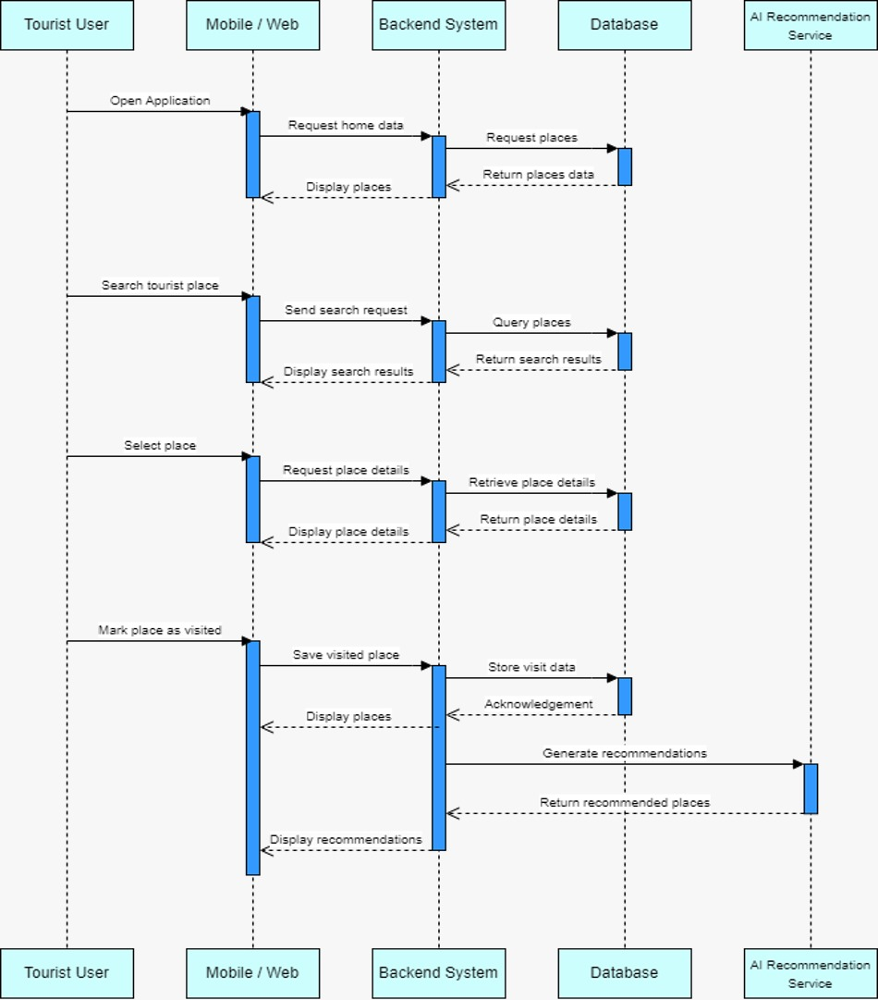
</p>

<p align="center">
  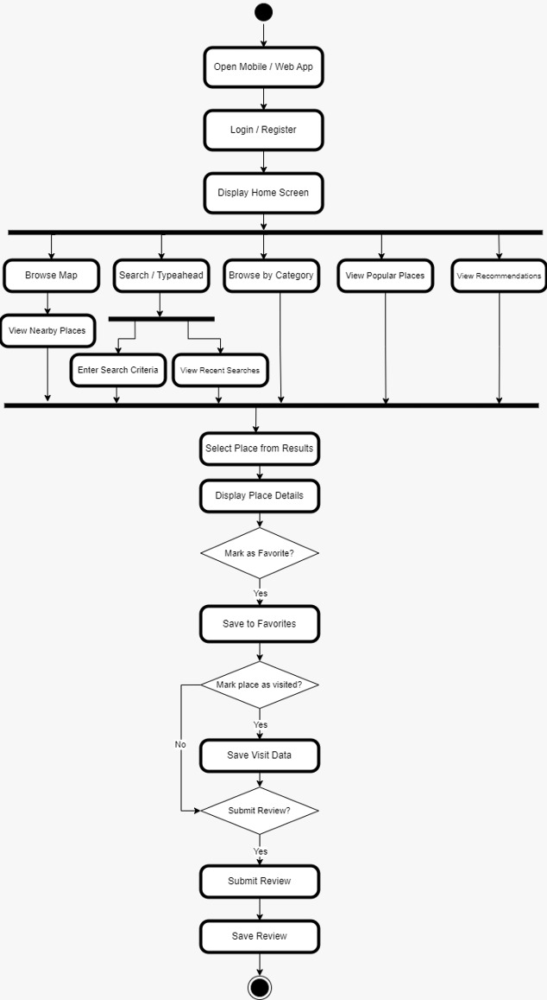
</p>

- **Multi-photo uploads** — up to 10MB per image, stored server-side with display ordering
- **Visitor-type pricing** — different prices for `ADULT`, `CHILD`, `STUDENT` × `EGYPTIAN`, `FOREIGNER`
- **Bilingual content** — names, descriptions, governorates stored in both Arabic and English
- **Reviews & Ratings** — per-place review system with auto-calculated average rating

### 🧑‍💼 Provider Marketplace

A full-featured marketplace connecting tourists with verified local service providers:

| Feature | Description |
|---------|-------------|
| **Three Service Types** | `GUIDE` — Tour guides, `TRANSLATOR` — Language translators, `DRIVER` — Vehicle drivers |
| **Verification Workflow** | Provider submits national ID (front & back photos) → Admin reviews → `APPROVED` / `REJECTED` with reason |
| **Profile Completion** | Two-step onboarding: register → complete profile (bio, rates, languages, vehicle info for drivers) |
| **Language Proficiency** | Providers list spoken languages with proficiency levels: `BEGINNER`, `INTERMEDIATE`, `FLUENT` |
| **Pricing** | Hourly (`ratePerHour`) and daily (`ratePerDay`) pricing with BigDecimal precision |
| **Availability Toggle** | Providers can toggle their availability on/off |
| **Ratings & Reviews** | Aggregate rating (avg + count), per-booking reviews from tourists |
| **Dashboard & Earnings** | Provider dashboard with booking stats, completion rates, and earnings analytics |
| **Search & Filter** | Tourists can filter by service type, sort by rating or price |
| **Driver Profiles** | Extended profile for drivers: vehicle type (`SEDAN`, `SUV`, `VAN`), vehicle capacity |

### 📅 Booking & Service Requests

A complete booking lifecycle with real-time status tracking and notifications:

<p align="center">
  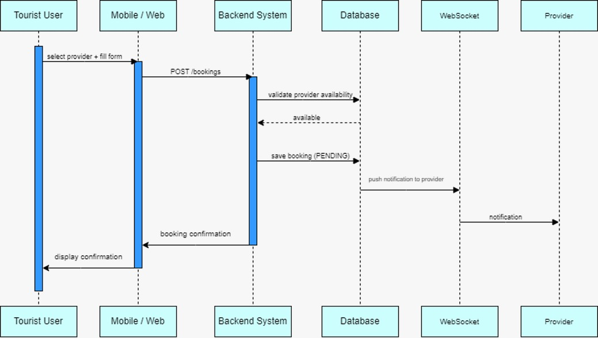
</p>

<p align="center">
  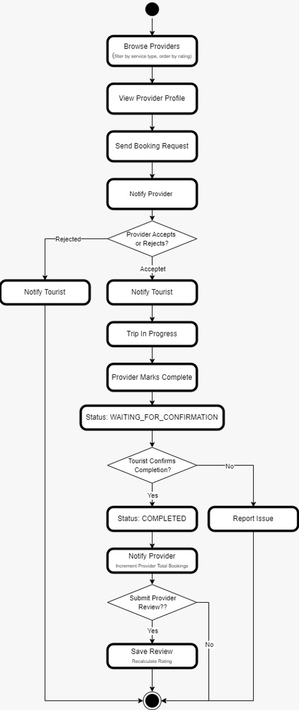
</p>

**Booking Lifecycle:**

```
PENDING → ACCEPTED → WAITING_FOR_CONFIRMATION → COMPLETED
   ↓         ↓                    ↓
CANCELLED  REJECTED         (Report Issue)
```

| Status | Triggered By | Description |
|--------|-------------|-------------|
| `PENDING` | Tourist | Booking request created, provider notified |
| `ACCEPTED` | Provider | Provider accepts the request (with optional message) |
| `REJECTED` | Provider | Provider rejects the request (with optional reason) |
| `WAITING_FOR_CONFIRMATION` | Provider | Provider marks trip as complete, awaiting tourist confirmation |
| `COMPLETED` | Tourist | Tourist confirms completion → prompts for provider review |
| `CANCELLED` | Tourist | Tourist cancels the booking |

**Booking Features:**
- Hourly & daily duration support with automatic price calculation
- Location-aware bookings with pickup latitude/longitude
- Vehicle type preferences for driver bookings (`SEDAN`, `SUV`, `VAN`)
- Translation language specification for translator bookings
- Additional notes field for special requests
- Post-completion **provider review** with star rating + comment

### 🔔 Real-Time Notifications

- **WebSocket (STOMP/SockJS)** push notifications for all booking status changes
- JWT-authenticated WebSocket handshake — supports both `Authorization` header and `access_token` query parameter
- Persistent notification storage in database with read/unread tracking
- User-specific notification queues: `/user/{userId}/queue/notifications`
- Unread count endpoint for badge display
- Topic-based broker: `/topic` (broadcast) and `/queue` (personal)

### 🌍 Internationalization (i18n)

- Full **English** and **Arabic** (العربية) support across all API responses
- `Accept-Language` header-driven locale resolution
- Localized error messages, success messages, and notification content
- AI chatbot and landmark service respond in the user's detected language
- User preferred language setting (toggleable via API)
- Bilingual data model — places, categories, and governorates stored in both AR/EN

### 🛡️ Admin Dashboard & Moderation

| Feature | Endpoint | Description |
|---------|---------|-------------|
| **Dashboard Analytics** | `GET /admin/dashboard` | Platform-wide statistics and metrics |
| **Provider Approval** | `PATCH /providers/{id}/approve` | Approve provider registration |
| **Provider Rejection** | `PATCH /providers/{id}/reject` | Reject with reason |
| **User Management** | `GET/DELETE /users`, `PATCH /users/{id}/account-status` | List, search, delete, activate/deactivate users |
| **Issue Management** | `GET/PUT /issues` | Track and resolve user-reported issues (`OPEN` → `IN_PROGRESS` → `RESOLVED` / `CLOSED`) |
| **Place Management** | `POST/PUT/DELETE /places` | Full CRUD with multi-image upload support |
| **Category Management** | `GET/POST/PUT/DELETE /categories` | Manage place categories with icons |

### 👤 User Management

- **Tourist profile completion** — phone number, country, gender, profile photo
- **Provider profile completion** — bio, national ID, experience years, rates, languages
- **Password change** — authenticated password update
- **Profile photo upload** — multipart file upload with server-side storage
- **Account deletion** — self-service account deletion
- **Preferred language toggle** — switch between AR/EN

---

## 🔀 Use Case Diagram

<p align="center">
  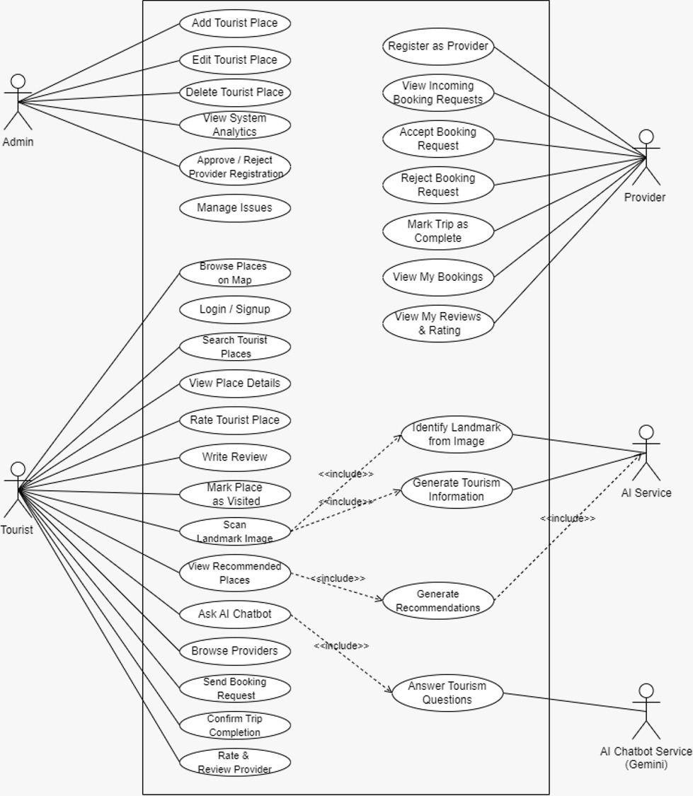
</p>

The diagram shows all system actors and their available use cases:
- **Admin** → Manage places, approve/reject providers, manage issues, view analytics
- **Tourist** → Browse/search places, book providers, use AI chatbot & landmark scanner, manage favorites/visited/reviews
- **Provider** → Register, manage bookings (accept/reject/complete), view reviews & earnings
- **AI Service** → Landmark recognition, recommendation generation
- **AI Chatbot (Gemini)** → Answer tourism questions with contextual, multilingual responses

---

## 🛠️ Tech Stack

| Category | Technology | Version |
|----------|-----------|---------|
| **Language** | Java (OpenJDK) | 17 |
| **Framework** | Spring Boot | 3.5.14 |
| **Security** | Spring Security + JJWT | 0.11.5 |
| **Data** | Spring Data JPA + Hibernate | — |
| **Database** | MySQL | 8.x |
| **Caching** | Redis + Spring Cache | — |
| **AI** | Spring AI + Google Gemini | 1.1.5 |
| **Real-Time** | Spring WebSocket (STOMP) | — |
| **HTTP Client** | Spring WebFlux (WebClient) | — |
| **API Docs** | SpringDoc OpenAPI (Swagger UI) | 2.8.5 |
| **Email** | Spring Mail (SMTP) | — |
| **Mapping** | MapStruct | 1.5.5 |
| **Boilerplate** | Lombok | 1.18.30 |
| **Auth (OAuth)** | Google API Client + Auth Library | 2.4.0 / 1.23.0 |
| **Monitoring** | Spring Actuator | — |
| **Validation** | Jakarta Bean Validation | — |
| **Build** | Maven Wrapper | — |
| **ML Microservice** | FastAPI (Python) | — |

---

## 🚀 Getting Started

### Prerequisites

| Requirement | Minimum Version |
|------------|----------------|
| **JDK** | 17+ |
| **Maven** | 3.8+ (or use included `mvnw`) |
| **MySQL** | 8.0+ |
| **Redis** | 7.0+ |
| **FastAPI Service** | Running on `localhost:8000` (for AI/ML features) |

### 1. Clone the Repository

```bash
git clone https://github.com/your-org/sawah-backend.git
cd sawah-backend
```

### 2. Configure Environment Variables

Create a `.env` file or set the following environment variables:

```properties
# ── Database ──────────────────────────────────────────────
DB_URL=jdbc:mysql://localhost:3306/sawah_db?createDatabaseIfNotExist=true&useSSL=false&serverTimezone=UTC
DB_USERNAME=root
DB_PASSWORD=your_db_password

# ── JWT Tokens ────────────────────────────────────────────
JWT_SECRET_KEY=your_base64_encoded_256bit_secret
JWT_EXPIRATION_TIME=3600000          # 1 hour (ms)
JWT_REFRESH_EXPIRATION_TIME=604800000 # 7 days (ms)

# ── Redis ─────────────────────────────────────────────────
REDIS_HOST=localhost
REDIS_PORT=6379
REDIS_USERNAME=default
REDIS_PASSWORD=your_redis_password

# ── Admin Account (auto-seeded on startup) ────────────────
ADMIN_EMAIL=admin@sawah.com
ADMIN_PASSWORD=your_admin_password

# ── Email (SMTP) ─────────────────────────────────────────
MAIL_HOST=smtp.gmail.com
MAIL_PORT=587
MAIL_USERNAME=your_email@gmail.com
MAIL_PASSWORD=your_app_password

# ── Email Validation ─────────────────────────────────────
VALIDATE_EMAIL_API_KEY=your_validation_api_key

# ── Google OAuth 2.0 ─────────────────────────────────────
GOOGLE_CLIENT_ID=your_web_client_id.apps.googleusercontent.com
GOOGLE_MOBILE_CLIENT_ID=your_mobile_client_id.apps.googleusercontent.com

# ── Gemini AI ─────────────────────────────────────────────
GEMINI_API_KEY=your_gemini_api_key
```

### 3. Build & Run

```bash
# Build the project (skip tests for faster startup)
./mvnw clean install -DskipTests

# Run the application
./mvnw spring-boot:run
```

> **Windows users:** Use `mvnw.cmd` instead of `./mvnw`.

The server starts on **`http://localhost:9091`**.

### 4. Verify the Setup

```bash
# Health check
curl http://localhost:9091/actuator/health

# Expected response:
# {"status":"UP"}
```

---

## 📚 API Documentation

Interactive Swagger UI is available once the server is running:

🔗 **[http://localhost:9091/swagger-ui/index.html](http://localhost:9091/swagger-ui/index.html)**

OpenAPI JSON spec: `http://localhost:9091/v3/api-docs`

### Key Endpoint Categories

| Prefix | Description | Auth | Role |
|--------|------------|:----:|:----:|
| `POST /api/v1/auth/login` | Email/password authentication | ❌ | — |
| `POST /api/v1/auth/google` | Google OAuth sign-in | ❌ | — |
| `POST /api/v1/auth/sign-up` | Tourist registration | ❌ | — |
| `POST /api/v1/auth/provider/sign-up` | Provider registration | ❌ | — |
| `POST /api/v1/auth/refresh` | Refresh access token | ❌ | — |
| `POST /api/v1/auth/forgot-password` | Initiate password reset | ❌ | — |
| `POST /api/v1/auth/reset-password` | Reset password with OTP | ❌ | — |
| `GET/POST /api/v1/places/**` | Place discovery, search, CRUD | ✅ | Tourist / Admin |
| `GET/POST /api/v1/providers/**` | Provider profiles & management | ✅ | Provider / Admin |
| `GET/POST /api/v1/bookings/**` | Service request lifecycle | ✅ | Tourist / Provider |
| `POST /api/v1/chats/messages` | AI chatbot conversations | ✅ | Tourist |
| `POST /api/v1/landmarks/explore` | AI landmark recognition | ✅ | Tourist |
| `GET /api/v1/notifications/me` | Notification feed | ✅ | Any |
| `GET/POST /api/v1/reviews/**` | Place reviews & ratings | ✅ | Tourist |
| `GET/POST /api/v1/categories/**` | Place categories | ✅ | Admin |
| `GET/POST /api/v1/services/**` | Service type management | ✅ | Admin |
| `GET /api/v1/users/**` | User management | ✅ | Admin / Self |
| `GET /api/v1/admin/**` | Admin dashboard | ✅ | Admin |
| `WS /ws-notifications` | WebSocket STOMP endpoint | JWT | Any |

---

## 📂 Project Structure

```
sawah-backend/
├── src/main/java/com/sawah/sawah_backend/
│   ├── config/                  # App, Security, Redis, WebSocket, CORS configs
│   ├── controller/              # 18 REST controllers
│   │   ├── AuthController           # Login, signup, OAuth, password reset, token refresh
│   │   ├── PlaceController          # 13 endpoints — CRUD, search, nearby, recommendations
│   │   ├── ProviderController       # 15 endpoints — registration, approval, dashboard
│   │   ├── BookingController        # 8 endpoints — full booking lifecycle + reviews
│   │   ├── ChatController           # AI chatbot conversations
│   │   ├── LandmarkController       # AI landmark recognition
│   │   ├── NotificationController   # Push notification management
│   │   ├── UserController           # Profile, password, account management
│   │   └── ...                      # Category, Review, Service, Issue, Favorite, etc.
│   ├── dto/                     # Request/Response DTOs
│   ├── enums/                   # Role, Status, ServiceCode, VehicleType, Gender, etc.
│   ├── exceptions/              # Custom exception classes + global handler
│   ├── helper/                  # Utility helpers
│   ├── mapper/                  # MapStruct mapper interfaces
│   ├── models/                  # 24 JPA entity classes
│   ├── repository/              # Spring Data JPA repositories
│   ├── requests/                # Request payload POJOs
│   ├── response/                # Response wrapper classes (ApiResponse, AuthResponse)
│   ├── security/
│   │   ├── jwt/                 # JWT filter, utils, token management
│   │   └── user/                # CustomUserDetails, UserDetailsService
│   └── service/                 # 28 service packages (interface + impl)
│       ├── aiService/
│       │   ├── chatbot/         # Gemini-powered conversational AI
│       │   └── landmark/        # Image → Landmark → AI info pipeline
│       ├── auth/                # Authentication, OAuth, token management
│       ├── booking/             # Service request lifecycle + price calculation
│       ├── notification/        # WebSocket push notification engine
│       ├── recommendation/      # ML-based place recommendations
│       ├── provider/            # Provider onboarding, approval, dashboard
│       ├── place/               # Place discovery, search, nearby, map bounds
│       ├── email/               # SMTP email service (OTP, reset)
│       ├── fileStorage/         # File upload/download management
│       └── ...                  # user, category, review, issue, favorites, etc.
├── src/main/resources/
│   ├── application.properties   # Configuration (env-var driven)
│   ├── i18n/
│   │   ├── messages.properties      # English messages
│   │   └── messages_ar.properties   # Arabic messages (العربية)
│   └── templates/               # Email templates
├── docs/
│   └── diagrams/                # Architecture, ERD, sequence & activity diagrams
├── pom.xml                      # Maven dependencies & build config
└── mvnw / mvnw.cmd              # Maven wrapper (no Maven install needed)
```

---

## 🤝 Contributing

We welcome contributions! Please follow these guidelines to keep the codebase clean and consistent.

### Branching Strategy

| Branch | Purpose |
|--------|---------|
| `main` | Production-ready releases |
| `develop` | Integration branch for features |
| `feature/<name>` | New feature development |
| `bugfix/<name>` | Bug fixes |
| `hotfix/<name>` | Urgent production fixes |

### Workflow

1. **Fork** the repository
2. **Create** a feature branch from `develop`:
   ```bash
   git checkout -b feature/awesome-feature develop
   ```
3. **Commit** your changes using [Conventional Commits](https://www.conventionalcommits.org/):
   ```
   feat(booking): add cancellation policy enforcement
   fix(auth): handle expired refresh token gracefully
   docs(readme): update environment variables section
   refactor(provider): extract rating calculation to service
   ```
4. **Push** to your fork and open a **Pull Request** against `develop`
5. Ensure your PR passes all CI checks before requesting review

### Conventional Commits Quick Reference

| Prefix | When to Use |
|--------|------------|
| `feat` | A new feature |
| `fix` | A bug fix |
| `docs` | Documentation only changes |
| `style` | Formatting, missing semicolons, etc. |
| `refactor` | Code change that neither fixes a bug nor adds a feature |
| `perf` | Performance improvement |
| `test` | Adding or correcting tests |
| `chore` | Build process, dependency updates, tooling |

---

## 📄 License

This project is licensed under the **MIT License** — see the [LICENSE](LICENSE) file for details.

---

<p align="center">
  <sub>Built with ❤️ by the Sawah Team</sub>
</p>
